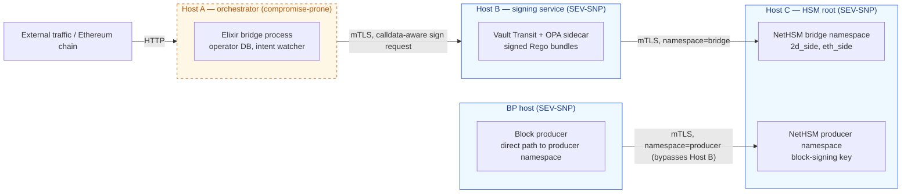
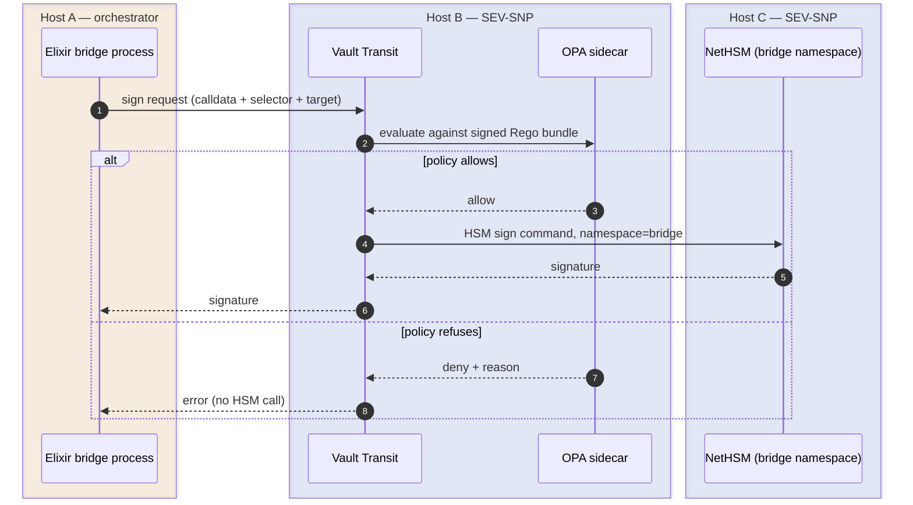
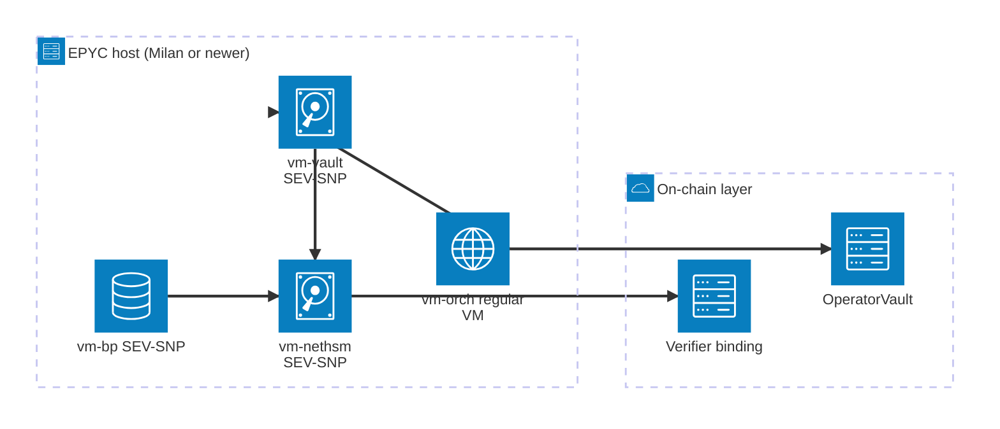

The bridge article describes *what* the 2D bridge does to prevent an operator key compromise from minting unbacked supply or draining the pool: load-bearing verifier bindings, an on-chain `OperatorVault`, and a fail-closed signer policy. Each of these layers exists as code somewhere. This article describes *where that code runs*, and why a single-host shortcut collapses the security model even with robust policy code on top.

The intended audience includes operators, security reviewers, and anyone evaluating the deployment posture before committing real capital across the bridge. The topology serves as the source of truth upon which the [bridge article](../bridge/) builds its safety reasoning.

## Why operator keys are the weak point

The bridge's defense-in-depth architecture treats every signature derived from an operator key as untrusted by default. The on-chain layers (the `OperatorVault`'s `bridgeOut` caps and the verifier's claimer-allowlist binding) constrain what a signature can authorize, even if the key is fully compromised. However, "the key is fully compromised" is precisely the assumption to plan around: a single attacker gaining root access on the host that holds the operator's keys represents the highest-impact host failure the bridge must survive, and the topology must ensure that this single event does not compromise the entire chain.

Two operator keys are enough to drain a wrapped bridge of the conventional kind; the same two keys are not enough to drain 2D's, because the on-chain layers refuse outbound calls outside a bounded shape. But host compromise is still where everything else starts. If `vault dev`, an OPA sidecar, and a NetHSM image all run as services on one Linux box, root on that box reads memory, swaps the OPA bundle, and signs whatever it wants. The off-chain defenses go down together, in one step.

The topology splits the off-chain signing path into three logical hosts on three independent trust boundaries, and adds AMD SEV-SNP confidential VMs around the security-critical components so host-root compromise on the underlying machine does not even read the in-memory keys. The on-chain layer then sits below all three as the durable last line.

## Two operator keys plus a producer key

The bridge operator is operationally one party. Cryptographically it uses two distinct keys, each in a separate signer with a separate scope. The block producer holds a third key.

**2D-side key.** Signs precompile calls to `bridge_lock(...)` on `0x2D00…0003`. The block executor blocks every other transaction shape from this address, so the only on-chain thing the key can do is invoke the bridge precompile. Compromise alone cannot mint unbacked supply: the verifier's claimer-allowlist binding rejects any cited Ethereum `Locked` event whose `claimer` is not in the configured operator allowlist, and an attacker self-funding an Ethereum lock with attacker-chosen `claimer` is rejected before any 2D-side mint commits.

**Ethereum-side key.** Signs `bridgeOut(address,uint256)` on the deployed `OperatorVault` smart contract. Cannot transfer USDC arbitrarily: the only privileged outflow is `bridgeOut`, bounded on-chain by `bridgeOutAllowlist`, `perTxCap`, and an exact rolling 24h `cumulativeCap`. Cannot call `lock`, cannot call `refund`, cannot call any other contract.

**Producer key.** Signs the block headers the block producer emits. Has no bridge authority — bridge claims do not flow through this key — but its compromise lets an attacker abuse block-production authority until verifier consensus or operational halt paths stop it. Invalid blocks still remain subject to the chain rules. The key therefore lives behind the same hardware/TEE substrate as the bridge keys, in its own namespace, with its own signing path that bypasses the bridge policy layer.

The three keys live in two NetHSM **namespaces** on the same HSM image: a `bridge` namespace with `2d_side` and `eth_side` key tags for the two operator keys, and a separate `producer` namespace for the block-signing key. Namespace isolation at the NetHSM layer means a request scoped to one namespace cannot reach another even if the calling client is fully compromised.

## Three logical hosts

A "host" in this document means a logical host — a separate VM or a separate physical machine, with a network boundary between it and its peers. The split holds at the boundary level even when two logical hosts physically share an EPYC server during pre-mainnet rehearsal. The three hosts are:

- **Host A — orchestrator.** The Elixir bridge process: HTTP API, Ethereum chain watcher, operator database. Most exposed to user traffic. Treated as compromise-prone, even though it is the same code we wrote.
- **Host B — signing service.** HashiCorp Vault Transit + an OPA sidecar enforcing a calldata-aware allowlist. Vault holds session identity, OPA evaluates the policy bundle, the HSM signs only what passes both. Network rules let only Host A talk to Host B inbound, and only Host B talk to Host C outbound for bridge signing.
- **Host C — HSM root.** The NetHSM image, holding all three keys behind namespace isolation. Network rules let Host B reach the `bridge` namespace and the block producer reach the `producer` namespace; everything else is dropped. Management interface lives on a separate, locked-down network segment with M-of-N admin quorum.

From staging onward the block producer runs in its own SEV-SNP VM for blast-radius reasons. It is shown separately because its signing path bypasses Host B, but it is not a fourth host in the bridge signing path: bridge signatures still traverse Host A → Host B → Host C.

The block producer's signing path bypasses Host B by design. Block-header digests have a fixed shape, the producer key is namespaced at the HSM level, and routing producer signatures through the bridge-side OPA bundle adds latency without adding policy that matters for header signing. So the rule is **Host B → Host C `bridge` namespace** *and* **BP host → Host C `producer` namespace**, drop everything else.

Two-host (orchestrator + Vault-with-HSM-on-same-box) collapses on Host B root compromise: attacker bypasses OPA and calls the HSM management API directly. Three-host puts a network boundary between policy decision (Host B) and key holding (Host C); compromise of B still requires further movement to reach key material or the HSM management plane.

Zero-host (fully on-chain) is convenient but every transaction proceeds with no off-chain throttling. Host A is unavoidable: it generates calldata in the first place. Host B and Host C add throttle layers on top; without them, a Host A compromise is one step away from "signed anything" until the on-chain `OperatorVault` catches it.

## The signing path

A successful bridge signing request traverses every bridge host in order:

The OPA bundle is a signed Rego policy that must stay in lockstep with the in-process Elixir allowlist on Host A. In the post-`OperatorVault` production posture described here, 2D-side requests must target `0x2D00…0003` with the `bridge_lock(...)` selector, and Ethereum-side requests must target the configured `OperatorVault` with `bridgeOut(address,uint256)`. Anything else — direct ERC-20 transfers, `lock()`, `refund()`, calls to any other contract — is rejected at policy time, before the HSM is asked to sign at all.

The bundle is hot-reloadable without restarting the signer, so policy updates do not interrupt service; bundle distribution is on its own admin-only path and never on the orchestrator → signer connection. Host B has a read-only filesystem where possible, and mTLS with cert pinning between every cross-host call.

## Confidential computing — what SEV-SNP buys

Hosts B and C run as **AMD SEV-SNP** confidential VMs on EPYC silicon (3rd-gen Milan or newer). The block producer's host runs the same. SEV-SNP encrypts VM memory with a per-VM key held by the AMD Secure Processor; the hypervisor and the host kernel cannot read VM memory by design. Every cross-VM connection verifies the peer's **launch measurement** — a cryptographic hash of the boot image — against a published expected value, so a swapped image fails the next attestation step and never gets a sign request.

The deployment view, with the three SEV-SNP VMs and the regular orchestrator VM all running on one EPYC chassis during pre-mainnet rehearsal, plus the on-chain layer that lives outside the host topology entirely:

This buys a specific trust model, and it is worth spelling out so reviewers can challenge it directly:

| Assumption | Status |
|---|---|
| AMD signing root is uncompromised | Trusted. State-actor-grade compromise of AMD's root key collapses every TEE-derived guarantee on these hosts. |
| AMD PSP firmware is patched | Trusted with an SLA. PSP has a published CVE history, microcode advisories from AMD are tracked, and updates are applied within an SLA appropriate to severity. New PSP CVEs revisit the mainnet HSM decision. |
| Hypervisor and host kernel | **Not trusted** for confidentiality. Host root cannot read VM memory by SEV-SNP design. That is precisely what is being bought. |
| VM image measurement matches expected | Gated. Each SEV-SNP VM's launch measurement is checked against an expected hash on every cross-VM connection. Image build and measurement publication are part of the deploy pipeline. Reproducible builds are required so any party can reproduce the expected measurement from source. |
| Side channels (Spectre-class, power, timing) | Partially mitigated. AMD patches as discovered; residual surface exists. Bridge keys are not held in long-running in-process state outside HSM/Vault, which limits what a side-channel leak can extract. |

A "compromise" of a host below assumes either software compromise *within* the trust boundary (CVE in app/Postgres/kernel inside the TEE) or full TEE bypass (PSP CVE, AMD root compromise, side-channel state-actor attack). The outcomes hold for both cases.

## Defense in depth

Each layer below is a separate door. An attacker has to open every door before causing damage of the corresponding kind. The off-chain doors live on different hosts; the on-chain doors are immutable and replicated across every honest verifier.

| Layer | Where it runs | What it refuses |
|---|---|---|
| In-process signer policy | Host A (orchestrator) | Sign requests that do not match the calldata-aware allowlist. First pass; redundant with Host B but catches programming errors before they cross the network. |
| Calldata-aware allowlist | Host B (Vault + OPA) | Same allowlist, enforced at the signing service before the HSM is asked. Survives Host A compromise. |
| HSM namespace scoping | Host C (NetHSM) | Cross-namespace access. A compromised Host B can only reach the `bridge` namespace; the `producer` namespace is unreachable from that path. |
| AMD SEV-SNP confidentiality | Hosts B, C, BP | Host-root and hypervisor reads of VM memory. Even with `sudo` on the underlying machine, the operator keys are not extractable. |
| Network policy + mTLS pinning | Cross-host | Signing connections from anywhere except the explicitly allowed peer. Bundle distribution is on its own admin path. |
| Verifier claimer-allowlist binding | On-chain (every honest verifier) | `bridge_lock` for an Ethereum `Locked` event whose `claimer` is not in the allowlist. Closes 2D-side-only key compromise. |
| `OperatorVault` on-chain caps | Ethereum, deployed | `bridgeOut` outside `bridgeOutAllowlist`, above `perTxCap`, or above the rolling 24h `cumulativeCap`. Bounds Ethereum-side-only key compromise to the configured policy envelope. |
| Vault governance behind multisig + timelock | Ethereum, governance principal | Caps, allowlists, and signing-key rotation outside the time-windowed authority of the governance multisig. |

Layers two through five are why the topology has three hosts instead of one. Skipping the host split keeps the layers in source code but collapses the door count from many to one.

## What survives compromise

The table below tracks the worst case for each compromise scope. "On-chain layer" refers to the verifier claimer-allowlist binding plus the deployed `OperatorVault` together; "off-chain layer" refers to everything from the orchestrator through the HSM.

| Compromise scope | What still holds |
|---|---|
| Host A only | For **bridge** signing: Vault and OPA on Host B see the calldata, refuse anything outside the allowlist; a compromised orchestrator cannot get a signed bridge payload outside scope. The separate BP host and `producer` namespace are not reachable from this path in the staging/mainnet topology. |
| BP host / producer key only | Bridge signing is unaffected because the BP path can reach only Host C's `producer` namespace. The attacker can abuse block-production authority for censorship, ordering, or valid-but-hostile block proposals until verifier consensus or halt paths respond; invalid blocks still fail chain-rule validation. |
| Host A + Host B | Sign-anything is now possible at the off-chain layer. The on-chain layer is the only protection: verifier claimer-allowlist binding (replayed by every honest verifier) plus `OperatorVault` caps (allowlist, per-tx, rolling 24h). The combination still bounds drain to `cumulativeCap` per 24h and rejects unbacked mint. |
| Host A + Host B + Host C | Off-chain layer is fully subverted. On-chain layer still holds: verifier consensus rejects unbacked mints, `OperatorVault` rejects out-of-scope outflows. |
| All hosts including BP, plus verifier majority plus `OperatorVault` governance | Catastrophic. Recovery via halt paths and governance reset. Outside the designed defense scope. |

The on-chain layer's coverage is the same regardless of which physical hardware the off-chain layer ran on, which is why the topology document and the safety document treat them as separate concerns.

## Forever software-in-TEE — pre-mainnet posture

Pre-mainnet (local dev, CI, staging, pre-launch) the project runs **without any physical HSM**. The HSM role is filled by NetHSM running in software inside an AMD SEV-SNP VM. This is policy, not aspiration, and it is the working assumption until mainnet sign-off.

The reasoning is concrete:

- **Memory encryption plus attestation closes most of what a physical HSM closes** for off-host attackers: host-root reads, hypervisor compromise, cold-boot, DMA. It does not close: AMD PSP firmware CVEs, side-channel state-actor attacks, and the absence of FIPS certification overall. Modern AMD CPUs do expose `RDRAND` and `RDSEED`, but those are not the same as a tamper-evident hardware TRNG with a certified entropy source.
- **Pre-mainnet there is no real value at risk on these keys.** The primary value of TEE-only is rehearsing the production topology end to end on the actual hardware that will run mainnet: attestation flow, namespace isolation, Vault and OPA wiring, audit-log replication, mTLS pinning. Buying a physical HSM that early is wasted budget and adds operational friction without closing a threat that matters at this stage.
- **The orchestrator-to-Vault-to-NetHSM path is identical** between software-NetHSM-in-TEE and a physical appliance behind the same REST endpoint. The mainnet swap (if chosen) is a Host C substitution, not a re-architecture. Nothing in pre-mainnet code or topology becomes throwaway.

The mainnet decision (forever software-in-TEE versus upgrade to a physical appliance) is deferred and reassessed close to launch based on:

1. Total value at risk on the operator wallet at mainnet launch.
2. Regulatory or jurisdictional ask, if any, for a FIPS-certified hardware boundary.
3. The AMD PSP CVE landscape at that point: patch cadence, residual unfixed advisories, side-channel research.

A third option is on the table for mainnet: a **hybrid posture** with the Ethereum-side key in a small physical token (FIPS 140-2 Level 3 hardware) and the 2D-side key in software-NetHSM-in-TEE. That diversifies single-vendor firmware and supply-chain risk without buying two full appliances. The trade-off is operational complexity from running two heterogeneous signing backends.

The pre-mainnet posture stated up front matters because deferring the choice without committing to a default is the same shape as quietly pre-committing to physical-HSM-or-bust later. Stating "forever software-in-TEE pre-mainnet" makes the boundary auditable: anyone can verify the staging hardware against the published image measurement, and any "we should ship a physical HSM tomorrow" emergency is a documented deviation, not an unstated assumption.

## Pre-mainnet rehearsal versus mainnet posture

Pre-mainnet topology can co-locate logical hosts on **one or two physical EPYC machines**, separated by VM boundaries:

- SEV-SNP VMs around `vm-vault` (Host B), `vm-nethsm` (Host C), and `vm-bp` (block producer).
- A regular KVM boundary around `vm-orch` (Host A), which is intentionally treated as compromise-prone.

Co-location is accepted for rehearsal because there is no real value at risk on the keys; the goal is to rehearse the production topology end to end on the actual hardware family that will run mainnet. The image-measurement attestation flow runs the same way whether VMs live on one EPYC or two.

Mainnet topology prefers **separate physical machines** for at least Host B and Host C, on different network zones, with mTLS and explicit allowlists between them. Same-physical-machine SEV-SNP isolation reduces hypervisor and cold-boot blast radius but does not protect against shared-power-supply or shared-side-channel scenarios; physical separation does. Data-center-level events (facility power, fire, fiber) require geographic separation and are tracked separately as an operational HA concern.

## Audit log topology

An append-only `bridge_audit_log` lives on Host A's Postgres with `REVOKE UPDATE, DELETE` so even the orchestrator's own database role cannot rewrite past entries. To keep evidence past Host A compromise, every write is mirrored to read-only object storage on a separate cloud account or VPC, with object-lock retention. A compromised Host A can stop writing new entries, but it cannot rewrite past entries; the post-incident timeline is preserved for forensic review.

The mirror destination, retention window, and access-control story are operational decisions that depend on cloud provider; the doc-level commitment is that the second copy lives somewhere the compromised orchestrator cannot reach.

## Trust model summary

The bridge operator's keys live behind three layered constraints. Each constraint can fail and the next one still holds:

1. **In-process and signing-service policy** refuse outbound calls outside `bridge_lock(...)` to the precompile and `bridgeOut(address,uint256)` to the deployed vault. Compromise at this layer is bounded by the next layer.
2. **AMD SEV-SNP confidentiality** prevents a host-root attacker from reading the keys themselves, even with `sudo` on the underlying machine. The launch-measurement check on every cross-VM connection prevents image substitution.
3. **The on-chain layer** is the durable last line. The verifier's claimer-allowlist binding rejects `bridge_lock` for Ethereum events with non-allowlisted claimers. The deployed `OperatorVault` enforces `bridgeOut` allowlist, per-tx cap, and rolling 24h `cumulativeCap` against the operator address itself, with governance behind a multisig and a timelock.

A successful drain requires a chain of compromises stretching from operator host through SEV-SNP attestation to on-chain governance, each layer at a different authority and a different blast radius. The off-chain layers buy time and limit the size of any one event; the on-chain layer caps the worst-case loss without depending on any host being honest.

Pre-mainnet, the off-chain layer runs entirely in SEV-SNP VMs on EPYC silicon, with no physical HSM in the topology. That choice is reassessed at mainnet launch against the value at risk and the AMD PSP CVE landscape. Whatever the mainnet choice, the orchestrator-to-Vault-to-NetHSM path stays the same and the on-chain layer keeps its caps; the substrate of the HSM swaps out behind the same REST endpoint.

## Where this fits into the broader architecture

- The [bridge article](../bridge/) walks through the protocol, the verifier's load-bearing cross-chain bindings, and the receipt-block claimer/hash probe; this article is the deployment context that makes the bridge's safety argument hold against host-root attackers.
- The [verifier article](../verifier/) describes the verifier's block-by-block recheck, including the cross-chain hook that reads from a helios sidecar.
- The on-chain `OperatorVault` lives in the [`2d-solidity`](https://github.com/igor53627/2d-solidity) repository; the contract is shipped and audited, and the source is the immutable last line referenced throughout this document.
