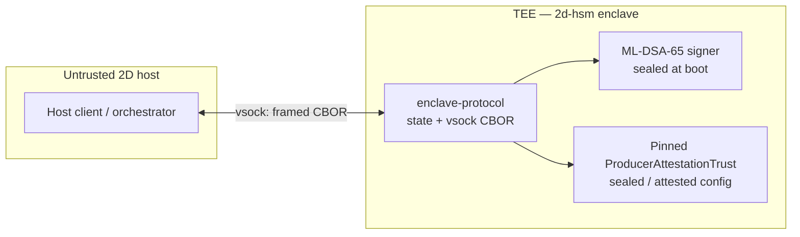
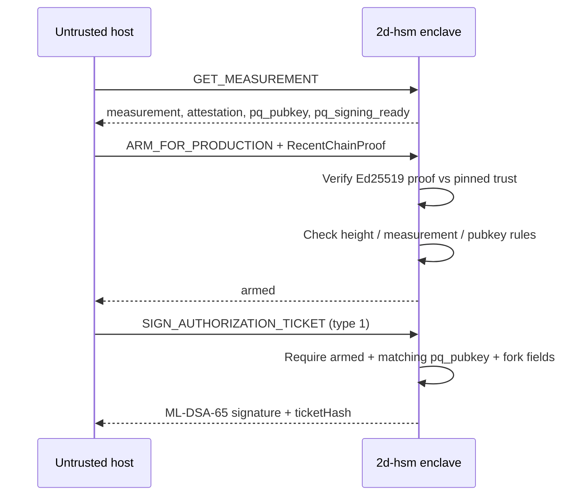

The [bridge operator HSM topology](../hsm-topology/) explains where **bridge** operator keys live: orchestrator, Vault + OPA, and NetHSM namespaces on three hosts. The **block producer** uses a separate long-term post-quantum key for block headers and for on-chain `AuthorizationTicket`s (producer recovery and hard-fork activation). That producer path is what the [**2d-hsm**](https://github.com/igor53627/2d-hsm) reference enclave implements: a small PQ signing service inside AMD SEV-SNP (or Nitro Enclaves), with a length-prefixed CBOR protocol over vsock to the untrusted 2D host.

This page is the architecture overview for that service. The normative wire format and security invariants live in the repository spec [`vsock-api-wire-format-spec-draft.md`](https://github.com/igor53627/2d-hsm/blob/main/backlog/docs/vsock-api-wire-format-spec-draft.md).

## What the enclave is responsible for

| Responsibility | Notes |
|---|---|
| **Block producer PQ signatures** | ML-DSA-65 (FIPS 204, parameter set ML-DSA-65) over the 32-byte block digest on the hot path (~2s cadence). |
| **`AuthorizationTicket` signatures** | Canonical `ticketHash` (Keccak256 + Solidity-aligned preimage); types **0** recovery and **1** hard-fork activation. |
| **Network-as-second-factor** | `ARM_FOR_PRODUCTION` requires a cryptographically verified `RecentChainProof` (Producer Chain Attestation v1, Ed25519) before the enclave arms. |
| **Attestation surface** | `GET_MEASUREMENT` returns TEE `measurement`, `attestation`, and `pq_pubkey` bound together in remote attestation. |

The enclave does **not** implement bridge `bridge_lock` / `bridgeOut` policy; that remains on the bridge operator topology. The producer key is a third cryptographic role in the wider system, with its own namespace and signing path.

## Host vs enclave trust boundary

The 2D host process is untrusted. It may craft vsock frames, replay old proofs, or lie about chain tip. The enclave must fail closed: reject malformed wire, reject tickets when not armed (for hard forks), reject stale or forged `RecentChainProof`s, and refuse to sign when no operational ML-DSA-65 key is installed.

**Critical rule:** `ProducerAttestationTrust` (the Ed25519 key that verifies chain proofs) is loaded **inside** the enclave from sealed config or attested provisioning. It must never be supplied by the host in an `ARM_FOR_PRODUCTION` payload.

## Vsock command surface (v1)

All messages use a 4-byte big-endian length prefix, one protocol-version byte, one message-type byte, then CBOR payload (max 1 MiB). Inner ARM / GET_STATUS / SIGN bodies use integer map keys per the spec.

| Command | Purpose |
|---|---|
| `GET_MEASUREMENT` | Remote attestation package + `pq_pubkey` + static `supported_ticket_types` + `pq_signing_ready`. |
| `ARM_FOR_PRODUCTION` | Bind armed state to `authorized_state` after verifying `RecentChainProof` + measurement consistency. |
| `GET_STATUS` | Armed metadata, pending hard-fork height, last known block from proof. |
| `SIGN_AUTHORIZATION_TICKET` | Sign canonical `ticketHash`; hard-fork (type 1) requires prior arm + stateful dispatch. |

**Dispatch split in the reference crate:**

- **Stateless** `dispatch_command` — recovery tickets (type 0) and `GET_MEASUREMENT` only; hard-fork and arm return explicit errors directing callers to the stateful path.
- **Stateful** `dispatch_command_with_state` — arming, `GET_STATUS`, and hard-fork signing with `EnclaveState` + pinned trust.

## Cryptography profile

| Item | Production value |
|---|---|
| Algorithm | ML-DSA (FIPS 204), parameter set **ML-DSA-65** |
| `pq_pubkey` | **1952** bytes |
| `signature` | **3309** bytes (pure ML-DSA over raw 32-byte `ticketHash`) |
| Chain proof | Ed25519 detached signature over domain-separated preimage (format v1) |

**`pq_signing_ready`:** `true` only after `install_sealed_pq_signer` succeeds at enclave boot. Default builds ship with **no** embedded secret key; `SIGN_AUTHORIZATION_TICKET` returns `PqSigningUnavailable` until provisioned. Hosts detect mock-era peers via `pq_signing_ready == false` and 64-byte PQ signatures (dev-only `test-support` + `demo-mock-sign`).

**Sealed key (TASK-1):** Production platform sealing (vTPM, SNP VMPL, etc.) is not implemented yet. The reference crate includes a **v0 XOR + measurement-bound** blob for `cargo test` only; non-test `ml-dsa-65` builds reject install until a real seal format exists.

## Arming and hard-fork gating

Hard-fork tickets must use `handle_sign_authorization_ticket_with_state` after a valid arm. Recovery tickets (type 0) may use the stateless path during bootstrap, but `pq_pubkey` in the ticket must still match the installed signer when a real key is active.

## Reference implementation status

The [`impl/rust/enclave-protocol`](https://github.com/igor53627/2d-hsm/tree/main/impl/rust/enclave-protocol) crate (high-risk per project `AGENTS.md`) currently includes:

- Framing, canonical `ticketHash`, and Solidity cross-check tests
- `EnclaveState` / arming monotonicity and hard-fork session rules
- Producer Chain Attestation v1 verification
- ML-DSA-65 signing with sealed-key install sketch and fail-closed production defaults

Still deferred: production seal format, live chain-tip refresh between arm and sign, full integer-key CBOR for every command, Elixir host shim, and real vsock transport in deployment.

## Relation to the bridge HSM topology

In [bridge operator HSM topology](../hsm-topology/), the **producer key** is shown reaching NetHSM’s `producer` namespace directly from the block-producer host, bypassing bridge Vault/OPA. **2d-hsm** is the dedicated minimal enclave design for that producer role on the 2D chain: PQ tickets and block signing inside one auditable service, with vsock as the only host interface. Pre-mainnet rehearsal may still colocate VMs on one EPYC chassis; the logical boundary (host untrusted, enclave holds the PQ secret) is the same whether the image runs as SEV-SNP software-NetHSM or a future physical HSM behind the same API.

## Further reading

- [Bridge operator HSM topology](../hsm-topology/) — three-host bridge signing and SEV-SNP posture
- [Security model](../security/) — chain-wide assumptions
- [2d-hsm repository](https://github.com/igor53627/2d-hsm) — specs, `AGENTS.md` review gates, and `impl/README.md` build matrix