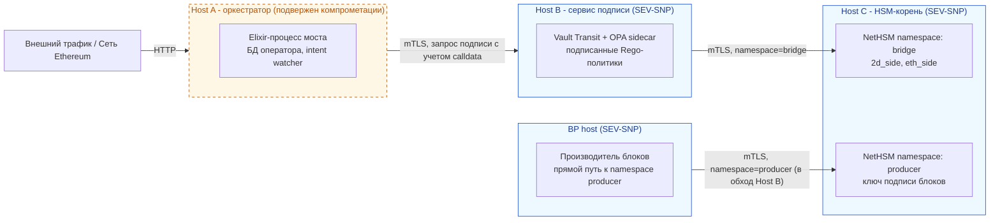
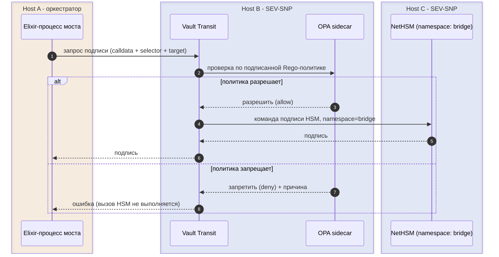
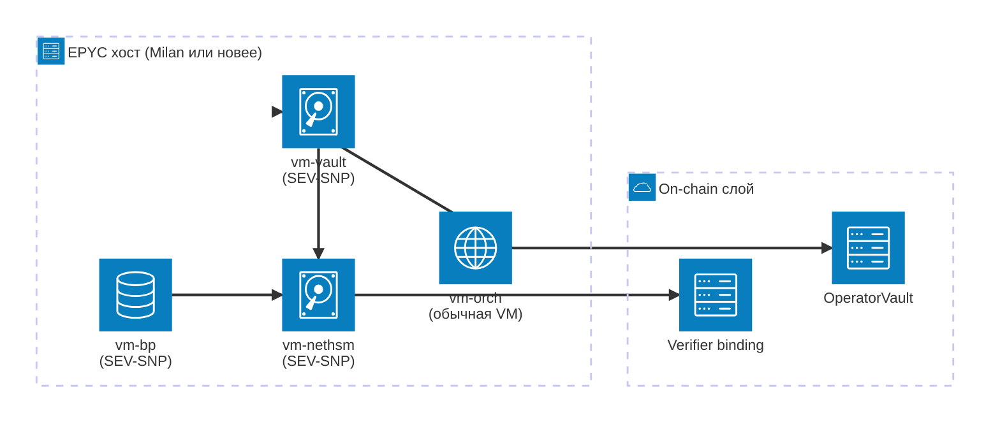

В статье про мост описано, *что именно* делает 2D, чтобы компрометация ключа оператора не позволила выпустить необеспеченные токены и вывести средства из пула. Это несущие привязки верификатора, смарт-контракт `OperatorVault` в сети Ethereum и политика подписания, которая по умолчанию запрещает любые действия. Каждый из этих слоев реализован в конкретном коде и развернут на конкретной инфраструктуре. В этом документе речь пойдет о том, *где именно* всё это запускается, и почему упрощение архитектуры до одного хоста разрушает всю модель безопасности, даже если политика в исходном коде безупречна.

Аудитория этого документа: операторы, аудиторы безопасности и все, кто оценивает модель развертывания перед тем, как доверить мосту реальный капитал. Топология служит фундаментом, на котором [статья про мост](../bridge/) выстраивает свои аргументы безопасности.

## Почему ключи оператора — слабое место

Эшелонированная защита моста по умолчанию считает любую подпись, созданную ключом оператора, недоверенной. On-chain слои (лимиты `OperatorVault.bridgeOut`, привязка claimer-а к allowlist-у на стороне верификатора) жестко ограничивают, *что* такая подпись может разрешить, даже если ключ был полностью скомпрометирован. Именно вокруг этого предположения и строится вся архитектура: атакующий с root-правами на хосте, где хранятся ключи оператора, рассматривается как сценарий отказа хоста с максимальным ущербом. Топология должна гарантировать, что одно такое событие не разрушит всю цепочку защиты.

Двух ключей оператора достаточно, чтобы опустошить классический wrapped-мост; однако в 2D тех же двух ключей не хватит, поскольку on-chain слои отклоняют любые исходящие вызовы, не соответствующие строго заданному формату. Тем не менее, компрометация хоста остается отправной точкой атаки. Если `vault dev`, сайдкар OPA и образ NetHSM работают как сервисы на одной Linux-машине, злоумышленник с root-правами сможет прочитать память, подменить OPA-политики и подписать всё, что захочет. Все off-chain защиты рухнут одновременно, в один шаг.

Поэтому топология разделяет off-chain путь подписи на три логических хоста с тремя независимыми границами доверия. Критичные для безопасности компоненты оборачиваются в AMD SEV-SNP, чтобы даже пользователь с root-правами на базовой машине не мог получить доступ к ключам в памяти. On-chain слой остается под всеми тремя хостами как последняя, наиболее устойчивая линия защиты.

## Два ключа оператора плюс ключ производителя блоков

С операционной точки зрения оператор моста действует как единый участник. Однако криптографически используются два разных ключа, каждый из которых находится в отдельном подписанте и имеет свою строго определенную область применения. У производителя блоков к ним добавляется третий ключ.

**Ключ стороны 2D.** Подписывает precompile-вызовы `bridge_lock(...)` к адресу `0x2D00…0003`. Исполнитель блоков блокирует любые другие транзакции с этого адреса, поэтому единственное, что этот ключ может сделать on-chain, — это вызвать bridge precompile. Сама по себе компрометация этого ключа не позволяет выпустить необеспеченные токены: привязка claimer-а к allowlist-у на стороне верификатора отклоняет любое событие Ethereum-`Locked`, чей `claimer` не входит в список разрешенных адресов оператора. Атакующий, который сам себе финансирует Ethereum-блокировку с произвольным `claimer`, отсекается еще до этапа выпуска токенов на стороне 2D.

**Ключ стороны Ethereum.** Подписывает вызовы `bridgeOut(address,uint256)` на развернутом смарт-контракте `OperatorVault`. Он не может произвольно переводить USDC: единственный привилегированный вывод — это `bridgeOut`, который ограничен on-chain параметрами `bridgeOutAllowlist`, `perTxCap` и строгим скользящим 24-часовым лимитом `cumulativeCap`. Этот ключ не способен вызвать функции `lock`, `refund` или обратиться к какому-либо другому контракту.

**Ключ производителя блоков.** Подписывает заголовки блоков. У него нет полномочий для работы с мостом (bridge-claim через этот ключ не проходит). Однако его компрометация позволяет злоупотреблять полномочиями производителя блоков до тех пор, пока консенсус верификаторов или механизмы остановки не прервут этот процесс. Невалидные блоки всё равно будут отклонены правилами цепи. Поэтому этот ключ хранится за тем же аппаратно-программным TEE-субстратом, что и ключи моста, но в отдельном пространстве имен (namespace) и с собственным путем подписи, в обход слоя bridge policy.

Все три ключа хранятся в двух **пространствах имен (namespaces)** одного образа NetHSM: `bridge` (с тегами ключей `2d_side`/`eth_side` для двух операционных ключей) и отдельный `producer` для ключа подписи блоков. Изоляция на уровне namespace в NetHSM гарантирует, что запрос, авторизованный для одного namespace, не сможет получить доступ к другому, даже если вызывающий клиент полностью скомпрометирован.

## Три логических хоста

Под «хостом» в этом документе понимается логический хост: отдельная виртуальная машина (VM) или отдельная физическая машина с сетевой границей, изолирующей ее от соседей. Это разделение сохраняется на уровне сетевых границ даже в том случае, когда два логических хоста физически работают на одном сервере EPYC во время pre-mainnet репетиций. Хосты:

- **Host A: оркестратор.** Elixir-процесс моста, включающий HTTP API, watcher сети Ethereum и базу данных оператора. Это самый открытый наружу компонент, через который проходит весь пользовательский трафик. Он считается наиболее подверженным риску компрометации, несмотря на то, что это наш собственный код.
- **Host B: сервис подписи.** HashiCorp Vault Transit + сайдкар OPA, который применяет политики allowlist с учетом calldata. Vault обеспечивает аутентификацию сессии, OPA проверяет политику (policy bundle), а HSM подписывает только те запросы, которые прошли оба слоя. Сетевые правила разрешают входящие соединения только по маршруту `Host A → Host B`, а исходящие — только `Host B → Host C` для подписей моста.
- **Host C: HSM-корень.** Образ NetHSM, хранящий все три ключа с изоляцией по namespace. Сетевые правила предоставляют `Host B` доступ только к namespace `bridge`, а производителю блоков — только к namespace `producer`; все остальные запросы отбрасываются. Интерфейс управления вынесен в отдельный закрытый сетевой сегмент, требующий админского кворума M-of-N.

Начиная со стадии staging, производитель блоков запускается в отдельной SEV-SNP VM для уменьшения радиуса поражения. На диаграмме он показан отдельно, поскольку его путь подписи обходит Host B, но он не становится четвертым хостом в цепочке подписей моста: подписи моста по-прежнему идут по маршруту Host A → Host B → Host C.

Путь подписи производителя блоков специально обходит Host B. Заголовки блоков имеют фиксированный формат, ключ producer-а изолирован на уровне HSM-namespace, а пропуск подписи производителя через OPA-политики моста лишь добавил бы задержку без какой-либо полезной проверки для заголовков. Поэтому действует жесткое правило: **`Host B → Host C` только для namespace=bridge** *и* **BP host → Host C только для namespace=producer**, всё остальное отбрасывается.

Схема с двумя хостами (оркестратор + Vault и HSM на одной машине) рушится при компрометации root-пользователя на Host B: атакующий обходит OPA и обращается к HSM management API напрямую. Схема с тремя хостами устанавливает сетевую границу между принятием решения по политике (Host B) и хранением ключей (Host C); одной компрометации Host B недостаточно, чтобы добраться до материала ключей или плоскости управления HSM.

Архитектура без хостов (полностью on-chain) удобна, но в ней каждая транзакция проходит без off-chain троттлинга. Host A необходим: именно он генерирует calldata. Host B и Host C добавляют дополнительные слои безопасности (throttle-слои); без них от компрометации Host A до возможности «подписать что угодно» остается всего один шаг, который может остановить только on-chain контракт `OperatorVault`.

## Путь подписи

Успешный запрос на подпись для моста проходит через все хосты по порядку:

OPA-bundle — это подписанная политика на языке Rego, которая должна быть синхронизирована с in-process allowlist-ом на Elixir на Host A. В продакшен-модели post-`OperatorVault`, описанной здесь, запросы на стороне 2D должны направляться к `0x2D00…0003` с селектором `bridge_lock(...)`, а запросы на стороне Ethereum — к сконфигурированному `OperatorVault` с селектором `bridgeOut(address,uint256)`. Всё остальное — прямые ERC-20 переводы, `lock()`, `refund()`, вызовы любых других контрактов — отбрасывается на этапе проверки политики, еще до того, как HSM получит запрос на подпись.

OPA bundle поддерживает горячую перезагрузку без перезапуска сервиса подписи, поэтому обновления политики не прерывают работу. Доставка bundle осуществляется по отдельному admin-only каналу, а не через соединение orchestrator → signer. Файловая система Host B по возможности монтируется в режиме read-only; все межхостовые вызовы защищены mTLS с привязкой сертификатов (cert pinning).

## Конфиденциальные вычисления: что дает SEV-SNP

Host B и Host C разворачиваются как конфиденциальные виртуальные машины (confidential VM) **AMD SEV-SNP** на процессорах EPYC (3-е поколение Milan и новее). Хост производителя блоков устроен аналогично. Технология SEV-SNP шифрует память VM ключом, который контролируется AMD Secure Processor; гипервизор и ядро хост-системы по определению не могут прочитать эту память. При каждом межмашинном (cross-VM) соединении проверяется **launch measurement** (криптографический хеш загрузочного образа) пира на соответствие опубликованному значению. Подмененный образ не пройдет аттестацию и не получит запрос на подпись.

Схема развертывания: три SEV-SNP VM и обычная VM оркестратора работают на одном сервере EPYC во время pre-mainnet репетиций; on-chain слой находится вне топологии хостов:

Эта модель доверия опирается на конкретный набор предположений, которые необходимо явно перечислить, чтобы аудиторы могли их оценить:

| Предположение | Статус |
|---|---|
| Корневой ключ подписи AMD не скомпрометирован | Доверенное предположение. Компрометация корневого ключа AMD на уровне государства (state actor) обнуляет все гарантии, предоставляемые TEE на этих хостах. |
| Прошивка AMD PSP обновлена (пропатчена) | Доверенное предположение с SLA. У PSP есть публичная история уязвимостей (CVE); рекомендации AMD отслеживаются, обновления микрокода устанавливаются с соблюдением SLA в зависимости от их критичности. Каждая новая CVE для PSP требует пересмотра решения по использованию HSM в mainnet. |
| Гипервизор и ядро хоста | **Не являются доверенными** с точки зрения конфиденциальности. Пользователь с root-правами на хосте по определению не может прочитать память SEV-SNP VM. Именно ради этого и используется данная технология. |
| Launch measurement образа VM совпадает с ожидаемым | Проверяется как обязательное условие (gate). При каждом cross-VM соединении launch measurement сверяется с ожидаемым хешем. Сборка образа и публикация measurement являются частью конвейера развертывания (deploy pipeline); воспроизводимые сборки (reproducible builds) обязательны, чтобы любой мог получить ожидаемый measurement из исходного кода. |
| Атаки по сторонним каналам (Spectre, питание, тайминги) | Частично закрыты. AMD выпускает патчи по мере обнаружения уязвимостей; однако остаточная поверхность атаки сохраняется. Ключи моста не хранятся в долгоживущем in-process состоянии вне HSM/Vault, что ограничивает объем данных, которые можно извлечь через утечки по сторонним каналам. |

Под «компрометацией» хоста в таблице ниже понимается либо программная компрометация *внутри* границы доверия (CVE в приложении, Postgres или ядре внутри TEE), либо полный обход TEE (CVE в PSP, компрометация корневого ключа AMD, атака по сторонним каналам уровня state actor). Выводы справедливы для обоих сценариев.

## Эшелонированная защита по слоям

Каждый из перечисленных ниже слоев действует как отдельная защитная дверь. Чтобы нанести ущерб соответствующего класса, атакующему необходимо взломать каждую из них. Off-chain двери расположены на разных хостах; on-chain двери неизменяемы и реплицированы на каждом честном верификаторе.

| Слой | Где работает | Что предотвращает |
|---|---|---|
| In-process signer policy | Host A (оркестратор) | Запросы на подпись, не соответствующие calldata-aware allowlist. Это первый проход; он дублирует проверки Host B, но позволяет отлавливать ошибки в коде до того, как они уйдут в сеть. |
| Calldata-aware allowlist | Host B (Vault + OPA) | Тот же allowlist, но применяемый на сервисе подписи до обращения к HSM. Эта защита сохраняется даже при компрометации Host A. |
| HSM namespace scoping | Host C (NetHSM) | Ограничивает доступ между пространствами имен. Скомпрометированный Host B может получить доступ только к namespace `bridge`; namespace `producer` для него недоступен. |
| AMD SEV-SNP confidentiality | Host B, C, BP | Предотвращает чтение памяти VM пользователем с root-правами на хосте и из гипервизора. Даже наличие `sudo` на хосте не позволит извлечь сами ключи. |
| Network policy + mTLS pinning | Между хостами | Блокирует соединения для подписи от любых источников, кроме явно разрешенного пира. Доставка политик (bundle) осуществляется по отдельному административному каналу. |
| Verifier claimer-allowlist binding | On-chain (каждый честный верификатор) | Отклоняет `bridge_lock` для событий Ethereum-`Locked`, чей `claimer` не входит в allowlist. Закрывает уязвимость при компрометации только 2D-ключа. |
| `OperatorVault` on-chain caps | Ethereum, развернутый смарт-контракт | Блокирует вызовы `bridgeOut` на адреса вне `bridgeOutAllowlist`, а также транзакции, превышающие `perTxCap` или скользящий 24-часовой `cumulativeCap`. Ограничивает ущерб при компрометации только Ethereum-ключа заданными рамками политики. |
| Vault governance за multisig + timelock | Ethereum, governance principal | Изменение лимитов, списков разрешенных адресов и ротация ключа подписи невозможны без авторизации через time-windowed governance multisig. |

Слои со второго по пятый — это именно та причина, по которой топология распределена на три хоста, а не сосредоточена на одном. Если отказаться от разделения хостов, логика в исходном коде останется, но вместо пяти защитных дверей останется только одна.

## Что сохраняется при компрометации

В таблице ниже представлен худший сценарий для каждой области компрометации. Под «on-chain слоем» здесь понимается привязка claimer-а к allowlist-у верификатора вместе с развернутым смарт-контрактом `OperatorVault`, а под «off-chain слоем» — вся инфраструктура от оркестратора до HSM.

| Область компрометации | Что продолжает защищать систему |
|---|---|
| Только Host A | Для **bridge** signing: Vault и OPA на Host B анализируют calldata и блокируют всё, что не входит в allowlist; скомпрометированный оркестратор не сможет получить подпись для bridge-payload вне разрешенной области. Отдельный BP host и namespace `producer` в топологии staging/mainnet недоступны с этого пути. |
| Только BP host / producer key | Подписание транзакций моста (bridge signing) не затронуто, так как путь BP имеет доступ только к namespace `producer` на Host C. Атакующий может злоупотреблять полномочиями производителя блоков для цензуры, изменения порядка транзакций или предложения валидных, но вредоносных блоков, пока консенсус верификаторов или механизмы остановки не отреагируют; невалидные блоки всё равно не пройдут проверку правил цепи. |
| Host A + Host B | На off-chain слое теперь возможна подпись любых данных (sign-anything). Систему защищает только on-chain слой: привязка claimer-а к allowlist-у (которую проверяет каждый честный верификатор) плюс лимиты `OperatorVault` (allowlist, per-tx, rolling 24h). В сумме возможный вывод средств ограничен лимитом `cumulativeCap` за 24 часа, а выпуск необеспеченных токенов по-прежнему блокируется. |
| Host A + Host B + Host C | Off-chain слой полностью контролируется атакующим. On-chain слой всё еще держится: консенсус верификаторов отклоняет необеспеченные выпуски токенов (mint), а `OperatorVault` блокирует несанкционированные выводы средств. |
| Все хосты (включая BP) + большинство верификаторов + `OperatorVault` governance | Катастрофический сценарий. Восстановление возможно только через механизмы экстренной остановки и сброс (reset) управления (governance). Этот сценарий выходит за рамки рассчитанной модели защиты. |

Надежность on-chain слоя не зависит от того, на каком физическом оборудовании работает off-chain инфраструктура. Именно поэтому документ о топологии и документ о безопасности рассматривают эти вопросы раздельно.

## Политика «навсегда software-in-TEE» на этапе pre-mainnet

На этапе pre-mainnet (локальная разработка, CI, staging, подготовка к запуску) проект работает **без использования физического HSM**. Роль HSM выполняет программное обеспечение NetHSM, запущенное внутри AMD SEV-SNP VM. Это строгая политика, а не просто пожелание, и она будет действовать вплоть до официального утверждения (sign-off) перед запуском mainnet.

Логика этого решения:

- **Шифрование памяти и аттестация (attestation) закрывают большую часть векторов атак, от которых защищает физический HSM**, для злоумышленников, не имеющих доступа к хосту: чтение памяти пользователем с root-правами, компрометацию гипервизора, атаки типа cold boot и DMA. Они не защищают от: уязвимостей (CVE) в прошивке AMD PSP, атак по сторонним каналам уровня state actor и принципиального отсутствия FIPS-сертификации. Современные процессоры AMD действительно предоставляют инструкции `RDRAND`/`RDSEED`, но это не то же самое, что аппаратно защищенный генератор случайных чисел (TRNG) с сертифицированным источником энтропии.
- **На ключах pre-mainnet нет реальных средств.** Главная цель использования TEE-only — это сквозная репетиция продакшен-топологии на том же оборудовании, на котором будет работать mainnet: процесс аттестации, изоляция пространств имен, интеграция Vault и OPA, репликация логов аудита, mTLS pinning. Покупка физического HSM на этой стадии — это пустая трата бюджета и создание операционных сложностей без устранения угроз, которые имеют реальное значение прямо сейчас.
- **Маршрут orchestrator → Vault → NetHSM остается неизменным** как для программного NetHSM-in-TEE, так и для физического устройства, находящегося за тем же REST endpoint. В случае перехода на mainnet потребуется лишь замена Host C, а не глобальная перестройка архитектуры. Никакой код или элементы топологии этапа pre-mainnet не будут выброшены.

Решение для mainnet — оставить программный HSM в TEE или перейти на физическое устройство — откладывается и будет пересмотрено ближе к запуску на основе трех критериев:

1. Сколько средств на operator wallet к моменту mainnet launch.
2. Регуляторные или юрисдикционные требования, если они будут, на FIPS-сертифицированную hardware boundary.
3. AMD PSP CVE landscape на момент решения: patch cadence, residual unfixed advisories, side-channel research.

Для mainnet рассматривается и третий вариант, **гибридная модель**: Ethereum-side ключ помещается в маленький физический токен (FIPS 140-2 Level 3 hardware), 2D-side остаётся в software-NetHSM-in-TEE. Это диверсифицирует single-vendor firmware и supply-chain risk без покупки двух полных appliance-ов. Цена - operational complexity от двух гетерогенных signing backend-ов.

Явно заявленная pre-mainnet-модель важна потому, что отложенный выбор без default-варианта по сути является тихим pre-commit на physical-HSM-or-bust позже. Заявление «forever software-in-TEE pre-mainnet» делает границу проверяемой: любой может сверить staging-железо с опубликованным image measurement, а срочный переход на физический HSM становится documented deviation, а не unstated assumption.

## Pre-mainnet rehearsal и mainnet-модель

На pre-mainnet логические хосты можно совмещать на **одной или двух физических EPYC-машинах**, разделённых VM-границами:

- SEV-SNP VM вокруг `vm-vault` (Host B), `vm-nethsm` (Host C) и `vm-bp` (производитель блоков).
- Обычная KVM-граница вокруг `vm-orch` (Host A), который намеренно считается наиболее подверженным компрометации.

Совмещение на этой стадии допустимо, потому что на ключах нет реальных средств; задача - отрепетировать продакшен-топологию end-to-end на той же hardware family, что будет крутить mainnet. Image-measurement attestation flow работает одинаково, независимо от того, лежат VM на одной EPYC или на двух.

Для mainnet предпочитаем **отдельные физические машины** хотя бы под Host B и Host C, в разных сетевых зонах, с mTLS и явными allowlist-ами между ними. SEV-SNP-изоляция в пределах одной машины уменьшает hypervisor- и cold-boot blast radius, но не закрывает shared-power-supply и shared-side-channel сценарии; физическое разделение закрывает. События уровня ДЦ (питание, пожар, оптика) требуют географического разнесения и трекаются отдельно как operational HA concern.

## Топология audit log

Append-only `bridge_audit_log` лежит на Postgres-е Host A с `REVOKE UPDATE, DELETE`, поэтому даже DB-роль самого оркестратора не перепишет прошлые записи. Чтобы evidence пережил компрометацию Host A, каждая запись зеркалится в read-only object storage на отдельном cloud-аккаунте или VPC, с object-lock retention. Скомпрометированный Host A может перестать писать новое, но прошлые записи он не перепишет; post-incident timeline сохраняется для forensic review.

Конкретные mirror destination, retention window и access-control story - операционные решения, зависящие от cloud-провайдера; на уровне документа важно одно: вторая копия живёт там, куда скомпрометированный оркестратор не дотянется.

## Итоговая модель доверия

Ключи оператора моста сидят за тремя слоями ограничений. Каждый из слоёв может упасть, и следующий продолжит держать:

1. **In-process и signing-service policy** отбрасывают исходящие вызовы вне `bridge_lock(...)` к precompile и `bridgeOut(address,uint256)` к развёрнутому vault. Компрометация на этом слое ограничена следующим.
2. **AMD SEV-SNP confidentiality** не даёт host-root-атакующему прочитать сами ключи, даже с `sudo` на хосте. Проверка launch measurement на каждом cross-VM-соединении не даёт подменить образ.
3. **On-chain слой** выступает как устойчивая последняя линия. Claimer-allowlist binding верификатора отбрасывает `bridge_lock` для Ethereum-event-ов с claimer-ом вне allowlist. Развёрнутый `OperatorVault` применяет `bridgeOut`-allowlist, per-tx cap и скользящий 24-часовой `cumulativeCap` против самого operator-адреса; governance управляется multisig-ом и timelock-ом.

Чтобы провернуть успешный drain, нужна цепочка компрометаций от operator host через SEV-SNP attestation до on-chain governance, причём каждый слой сидит на своей authority и даёт свой blast radius. Off-chain слои покупают время и ограничивают размер любого одного события; on-chain слой ограничивает худшую потерю и не зависит ни от какого хоста.

На pre-mainnet off-chain слой полностью крутится в SEV-SNP VM на EPYC-процессорах, без физического HSM в топологии. Это решение пересматривается к mainnet launch с учётом value at risk и AMD PSP CVE landscape. Какой бы выбор там ни случился, маршрут orchestrator → Vault → NetHSM остаётся прежним и on-chain слой держит свои капы; HSM-субстрат меняется за тем же REST endpoint.

## Как это вписывается в остальную цепь

- [Статья про мост](../bridge/) разбирает протокол, несущие cross-chain привязки верификатора и receipt-block проверку claimer/hash; здесь мы даём контекст развёртывания, который позволяет safety-аргументам моста выдерживать host-root-атакующих.
- [Статья про verifier](../verifier/) описывает block-by-block recheck верификатора, включая cross-chain hook, читающий через helios sidecar.
- On-chain `OperatorVault` живёт в репозитории [`2d-solidity`](https://github.com/igor53627/2d-solidity); контракт отгружен и прошёл аудит, его исходник - неизменяемая последняя линия защиты, на которую этот документ ссылается на протяжении всего текста.
