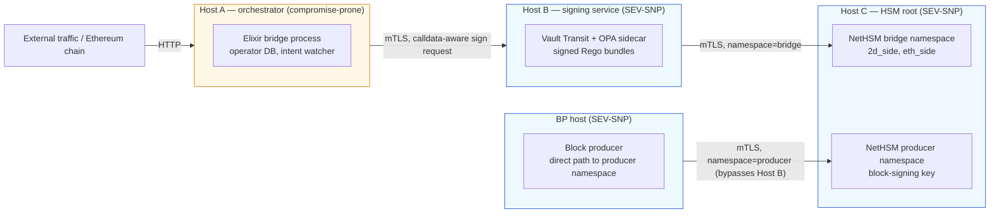
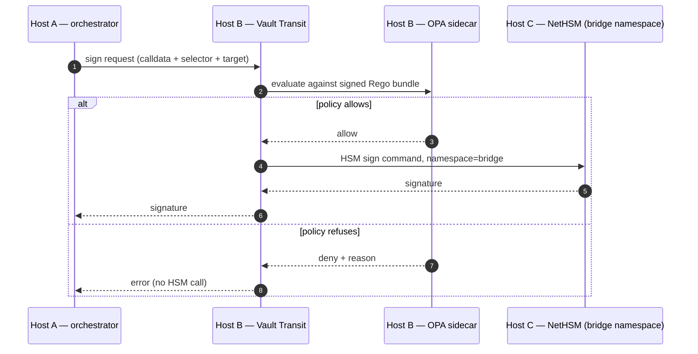

import hsmTopology from '../../architecture/hsm-topology.svg';

Артикл про мост описывает, *что* делает 2D, чтобы компрометация ключа оператора не давала минтить unbacked supply и не уводила pool. Пять верификаторных привязок, on-chain `OperatorVault`, fail-closed signer policy. Каждый из этих слоёв — это код, который где-то выполняется. Этот артикл описывает, *где этот код выполняется* — и почему single-host shortcut, даже с правильной policy на софтверном уровне, схлопывает всю модель.

Аудитория — операторы, security reviewer-ы и все, кто оценивает deployment posture перед тем, как пропускать через мост реальный капитал. Топология — source of truth, поверх которого [артикл про мост](../bridge/) выстраивает рассуждения про safety.

## Почему ключи оператора — слабое место

Defense-in-depth моста по умолчанию относится к любой signature, выпущенной ключом оператора, как к недоверенной. On-chain слои (`OperatorVault.bridgeOut`-капы, claimer-allowlist binding на стороне верификатора) ограничивают, *что* эта signature может выразить, даже если ключ полностью скомпрометирован. Но «ключ полностью скомпрометирован» — ровно то предположение, под которое надо проектировать: один атакующий с root-ом на хосте, где лежат ключи оператора — это самое дорогое, что может случиться с мостом, и топология должна не дать одному такому событию закончить чейн.

Двух ключей оператора достаточно, чтобы слить классический wrapped-bridge; тех же двух ключей недостаточно, чтобы слить мост 2D, потому что on-chain слои отказываются от outbound-вызовов вне ограниченной формы. Но host compromise — всё ещё точка, с которой всё начинается. Если `vault dev`, OPA sidecar и образ NetHSM крутятся как сервисы на одной Linux-коробке, root на этой коробке читает память, подменяет OPA-bundle и подписывает что хочет. Off-chain защиты падают одновременно, в один шаг.

Топология делит off-chain signing path на три логических хоста на трёх независимых trust boundary, и оборачивает security-critical компоненты в AMD SEV-SNP confidential VM-ы, чтобы host-root-компрометация под VM-ой даже не читала in-memory ключи. On-chain слой потом сидит под всеми тремя как durable last line.

## Два ключа оператора плюс ключ продюсера

Оператор моста операционно — один участник. Криптографически у него два разных ключа, каждый в отдельном signer-е и со своей областью применения. У block producer-а — третий ключ.

**2D-side ключ.** Подписывает precompile-вызовы `bridge_lock(...)` к `0x2D00…0003`. Block executor блокирует все остальные формы транзакций с этого адреса, поэтому единственное, что ключ может сделать on-chain — вызвать bridge precompile. Сам по себе компрометация не даёт минтить unbacked supply: claimer-allowlist binding на стороне верификатора отвергает любой `Locked`-event на Ethereum, чей `claimer` не входит в configured operator allowlist, а атакующий, само-фондирующий Ethereum-lock с собственным `claimer`, отбрасывается ещё до того, как commit-ится 2D-side mint.

**Ethereum-side ключ.** Подписывает `bridgeOut(address,uint256)` на развёрнутом смарт-контракте `OperatorVault`. Не может произвольно перевести USDC: единственный privileged outflow — `bridgeOut`, ограниченный on-chain через `bridgeOutAllowlist`, `perTxCap` и точный rolling 24h `cumulativeCap`. Не может вызвать `lock`, не может вызвать `refund`, не может вызвать никакой другой контракт.

**Producer ключ.** Подписывает заголовки блоков, которые эмитит block producer. Bridge-полномочий нет — bridge-claim-ы через этот ключ не идут — но его компрометация позволяет атакующему производить блоки против правил чейна, поэтому он живёт за тем же hardware/TEE-substrate-ом, что и bridge-ключи, в своём namespace, с собственным signing path, который обходит bridge policy layer.

Все три ключа лежат в трёх **namespace**-ах NetHSM на одном HSM-образе: namespace `bridge` с тегами `2d_side`/`eth_side` для двух operational ключей, и отдельный namespace `producer` для block-signing ключа. Изоляция на уровне namespace в NetHSM означает, что request, scoped к одному namespace, не может дотянуться до другого, даже если вызывающий клиент полностью скомпрометирован.

## Три логических хоста

«Хост» в этом документе — это логический хост: отдельная VM или отдельная физическая машина, с network boundary между ним и его соседями. Деление держится на уровне boundary даже когда два логических хоста физически делят один EPYC-сервер на pre-mainnet rehearsal. Хосты:

- **Host A — orchestrator.** Elixir bridge process: HTTP API, watcher Ethereum-цепи, operator database. Самый exposed под user-traffic. Рассматривается как compromise-prone, даже несмотря на то, что это код, который мы сами написали.
- **Host B — signing service.** HashiCorp Vault Transit + OPA sidecar, который enforce-ит calldata-aware allowlist. Vault держит session identity, OPA evaluate-ит policy bundle, HSM подписывает только то, что прошло через оба. Network rules дают inbound только `Host A → Host B`, и outbound от `Host B → Host C` для bridge signing.
- **Host C — HSM root.** NetHSM-образ, держит все три ключа за namespace-изоляцией. Network rules дают `Host B` доступ к namespace `bridge`, а block producer-у — к namespace `producer`; всё остальное дропается. Management interface живёт на отдельном, locked-down сегменте сети с M-of-N admin quorum.

Signing path block producer-а обходит Host B by design. Заголовки блоков имеют фиксированную форму, producer-ключ namespaced на уровне HSM, а проп producer signatures через bridge-side OPA bundle добавляет latency без policy, которая что-то значит при подписи заголовков. Поэтому правило: **`Host B → Host C` namespace=bridge** *и* **BP host → Host C namespace=producer**, всё остальное — drop.

Two-host (orchestrator + Vault-with-HSM-on-same-box) схлопывается на root-Host-B компрометации: атакующий обходит OPA и зовёт HSM management API напрямую. Three-host ставит network boundary между policy decision (Host B) и хранением ключей (Host C); компрометация B всё ещё требует дальнейшего движения, чтобы достать HSM-ключ.

Zero-host (полностью on-chain) удобно, но каждая транзакция проходит без off-chain throttling. Host A неустраним: он генерирует calldata в первую очередь. Host B и Host C добавляют throttle layer-ы поверх; без них компрометация Host A — один шаг до «sign anything», пока on-chain `OperatorVault` не поймает.

## Signing path

Успешная bridge-claim signature проходит через все хосты по порядку:

OPA-bundle — подписанная Rego policy, которая зеркалит in-process Elixir allowlist на Host A: 2D-side request-ы должны уходить на `0x2D00…0003` с селектором `bridge_lock(...)`; Ethereum-side request-ы должны уходить на сконфигурированный `OperatorVault` с `bridgeOut(address,uint256)`. Всё остальное — прямые ERC-20 transfer-ы, `lock()`, `refund()`, вызовы любых других контрактов — отвергается на policy time, ещё до того, как HSM получает запрос на подпись.

Bundle hot-reloadable без рестарта signer-а, поэтому policy-обновления не прерывают service; bundle distribution идёт по своему admin-only пути и никогда не по orchestrator → signer соединению. Host B имеет read-only filesystem где возможно, и mTLS с cert pinning между всеми cross-host вызовами.

## Confidential computing — что покупает SEV-SNP

Host B и Host C крутятся как **AMD SEV-SNP** confidential VM-ы на EPYC-кремнии (3-е поколение Milan и новее). Хост block producer-а — то же самое. SEV-SNP шифрует память VM ключом per-VM, который держит AMD Secure Processor; гипервизор и kernel хоста по построению не могут читать память VM. Каждое cross-VM соединение проверяет **launch measurement** пира — криптографический хеш boot image — против опубликованного expected value, поэтому подменённый образ падает на следующем attestation step и sign-request не получает.

Trust model, которая из этого получается, конкретный набор предположений — и его стоит выписать явно, чтобы reviewer мог их оспорить:

| Предположение | Статус |
|---|---|
| AMD signing root не скомпрометирован | Trusted. Компрометация AMD root-ключа state-actor-уровня обнуляет каждую TEE-derived гарантию на этих хостах. |
| AMD PSP firmware пропатчен | Trusted с SLA. У PSP опубликованная история CVE, AMD-advisories отслеживаются, microcode-обновления применяются с SLA, соответствующим severity. Новые PSP CVE заставляют пересмотреть mainnet HSM decision. |
| Гипервизор и kernel хоста | **Не trusted** для confidentiality. Host root по построению SEV-SNP не может читать память VM. Это ровно то, что покупается. |
| Launch measurement образа VM совпадает с expected | Gated. Launch measurement каждой SEV-SNP VM проверяется против expected hash на каждом cross-VM соединении. Сборка образа и публикация measurement — часть deploy-pipeline. Reproducible builds обязательны, чтобы любая сторона могла воспроизвести expected measurement из исходников. |
| Side-channel-ы (Spectre-class, power, timing) | Частично mitigated. AMD патчит по мере обнаружения; residual surface остаётся. Bridge-ключи не лежат long-running in-process state вне HSM/Vault, что ограничивает то, что side-channel-leak может extract-ить. |

«Компрометация» хоста в таблице ниже подразумевает либо software-компрометацию *внутри* trust boundary (CVE в app/Postgres/kernel внутри TEE), либо полный TEE bypass (PSP CVE, AMD root compromise, side-channel state-actor attack). Outcome-ы держатся для обоих случаев.

## Defense in depth

Каждый слой ниже — отдельная дверь. Атакующему нужно открыть каждую дверь до причинения ущерба соответствующего класса. Off-chain двери живут на разных хостах; on-chain двери immutable и реплицированы на каждый честный verifier.

| Слой | Где работает | Что отвергает |
|---|---|---|
| In-process signer policy | Host A (orchestrator) | Sign-request-ы, не матчящие calldata-aware allowlist. First pass; redundant с Host B, но ловит programming errors до того, как они уйдут в сеть. |
| Calldata-aware allowlist | Host B (Vault + OPA) | Тот же allowlist, enforced на signing service до того, как HSM спросят. Переживает компрометацию Host A. |
| HSM namespace scoping | Host C (NetHSM) | Cross-namespace доступ. Скомпрометированный Host B может дотянуться только до namespace `bridge`; namespace `producer` недостижим с этого пути. |
| AMD SEV-SNP confidentiality | Host B, C, BP | Host-root и hypervisor чтения памяти VM. Даже с `sudo` на underlying-машине ключи оператора не извлекаемы. |
| Network policy + mTLS pinning | Cross-host | Signing-соединения откуда-либо, кроме явно разрешённого пира. Bundle distribution — на отдельном admin path. |
| Verifier claimer-allowlist binding | On-chain (каждый честный verifier) | `bridge_lock` для Ethereum `Locked`-event, чей `claimer` не в allowlist. Закрывает 2D-side-only компрометацию ключа. |
| `OperatorVault` on-chain caps | Ethereum, развёрнут | `bridgeOut` вне `bridgeOutAllowlist`, выше `perTxCap` или выше rolling 24h `cumulativeCap`. Закрывает Ethereum-side-only компрометацию ключа. |
| Vault governance за multisig + timelock | Ethereum, governance principal | Каpы, allowlist-ы и ротация signing-key вне time-windowed authority governance multisig-а. |

Слои со второго по пятый — причина, по которой топология имеет три хоста, а не один. Пропуск host-split оставляет слои в исходниках, но схлопывает количество дверей с многих до одной.

## Что переживает компрометацию

Таблица ниже трекает worst case для каждого compromise scope. «On-chain слой» — это claimer-allowlist binding на стороне верификатора плюс развёрнутый `OperatorVault` вместе; «off-chain слой» — это всё от orchestrator-а до HSM-а.

| Compromise scope | Что ещё держится |
|---|---|
| Только Host A | Для **bridge** signing: Vault и OPA на Host B видят calldata, отвергают всё вне allowlist; скомпрометированный orchestrator не может получить bridge-payload вне scope. Для **block-producer** signing: BP-direct path к Host C namespace=producer обходит Host B by design, поэтому producer-key signatures не policy-gated off-chain при компрометации Host A. Block-content abuse (цензура, мошенническое включение в рамках ruleset) ограничен только самим ruleset чейна и verifier consensus по cross-chain bindings. Bridge supply остаётся защищён claimer-allowlist binding верификатора; более широкий BP-key abuse требует, чтобы on-chain слои поймали. |
| Host A + Host B | Sign-anything на off-chain слое теперь возможно. On-chain слой — единственная защита: claimer-allowlist binding (replay-ит каждый честный verifier) плюс `OperatorVault` caps (allowlist, per-tx, rolling 24h). Комбинация всё ещё bound-ит drain до `cumulativeCap` за 24 часа и отвергает unbacked mint. |
| Host A + Host B + Host C | Off-chain слой полностью subverted. On-chain слой всё ещё держится: verifier consensus отвергает unbacked mint-ы, `OperatorVault` отвергает out-of-scope outflow-ы. |
| Все хосты + verifier majority + `OperatorVault` governance | Catastrophic. Recovery через halt paths и governance reset. Вне designed defense scope. |

On-chain слой даёт coverage, не зависящий от того, на каком физическом железе крутился off-chain слой — поэтому topology document и safety document разводят их как разные concerns.

## Forever software-in-TEE — pre-mainnet posture

Pre-mainnet (local dev, CI, staging, pre-launch) проект работает **без какого-либо физического HSM**. Роль HSM выполняет NetHSM, запущенный в software внутри AMD SEV-SNP VM. Это policy, не aspiration, и это working assumption до mainnet sign-off.

Логика конкретная:

- **Memory encryption + attestation закрывает большую часть того, что закрывает физический HSM** для off-host-атакующих: host-root reads, hypervisor compromise, cold-boot, DMA. Не закрывает: AMD PSP firmware CVE, side-channel state-actor attack-и, отсутствие FIPS-сертификации в целом. Современные AMD CPU действительно exposing `RDRAND`/`RDSEED`, но это не то же самое, что tamper-evident hardware TRNG с сертифицированным entropy source-ом.
- **Pre-mainnet на этих ключах нет реального value at risk.** Главная ценность TEE-only — отрепетировать production-топологию end-to-end на том самом железе, на котором будет крутиться mainnet: attestation flow, namespace isolation, обвязка Vault и OPA, репликация audit-log, mTLS pinning. Покупать физический HSM на этой стадии — потраченный бюджет и operational friction без закрытия threat-а, который имеет значение на этом этапе.
- **Path orchestrator → Vault → NetHSM идентичный** между software-NetHSM-in-TEE и физическим appliance за тем же REST endpoint. Mainnet swap (если выбран) — это substitution Host C, а не re-architecture. Ничто из pre-mainnet кода или топологии не становится throwaway.

Mainnet decision (forever software-in-TEE против upgrade на физический appliance) отложен и пересматривается ближе к запуску по трём критериям:

1. Total value at risk на operator wallet на mainnet launch.
2. Regulatory или jurisdictional ask, если есть, на FIPS-сертифицированный hardware boundary.
3. AMD PSP CVE landscape на момент решения: patch cadence, residual unfixed advisories, side-channel research.

Третий вариант на столе для mainnet — **hybrid posture**: Ethereum-side ключ в маленьком физическом токене (FIPS 140-2 Level 3 hardware), 2D-side ключ в software-NetHSM-in-TEE. Это диверсифицирует single-vendor firmware и supply-chain risk без покупки двух полных appliance-ов. Trade-off — operational complexity от ведения двух гетерогенных signing backend-ов.

Pre-mainnet posture, заявленная явно с самого начала, важна потому что откладывание выбора без default-а — это та же форма, что и тихое pre-commit-ирование на physical-HSM-or-bust позже. Заявление «forever software-in-TEE pre-mainnet» делает boundary auditable: любой может верифицировать staging-железо против published image measurement, и любая «нам нужно завтра ставить физический HSM» паника становится documented deviation, а не unstated assumption.

## Pre-mainnet rehearsal vs mainnet posture

Pre-mainnet топология может co-locate логические хосты на **одной или двух физических EPYC-машинах**, разделённых VM-границами:

- SEV-SNP VM-ы вокруг `vm-vault` (Host B), `vm-nethsm` (Host C) и `vm-bp` (block producer).
- Обычная KVM-граница вокруг `vm-orch` (Host A), который намеренно рассматривается как compromise-prone.

Co-location принимается для rehearsal, потому что на ключах нет реального value at risk; цель — отрепетировать production-топологию end-to-end на той же hardware family, что будет крутить mainnet. Image-measurement attestation flow работает одинаково независимо от того, лежат VM-ы на одном EPYC или на двух.

Mainnet топология предпочитает **отдельные физические машины** хотя бы для Host B и Host C, на разных network zones, с mTLS и явными allowlist-ами между ними. Same-physical-machine SEV-SNP isolation уменьшает hypervisor- и cold-boot-blast-radius, но не защищает от shared-power-supply или shared-side-channel сценариев; physical separation защищает. DC-уровневые события (facility power, fire, fiber) требуют geographic separation и трекаются отдельно как operational HA concern.

## Топология audit log

Append-only `bridge_audit_log` живёт на Postgres-е Host A с `REVOKE UPDATE, DELETE`, поэтому даже DB-роль самого orchestrator-а не может переписать прошлые записи. Чтобы сохранить evidence после компрометации Host A, каждая запись зеркалится в read-only object storage на отдельном cloud-аккаунте или VPC, с object-lock retention. Скомпрометированный Host A может перестать писать новые записи, но не может переписать прошлые; post-incident timeline сохраняется для forensic review.

Mirror destination, retention window и access-control story — operational decisions, зависящие от cloud provider; doc-уровневое обязательство — что вторая копия живёт там, куда скомпрометированный orchestrator не дотянется.

## Trust model summary

Ключи оператора моста живут за тремя layered constraint-ами. Каждый constraint может упасть, и следующий ещё держится:

1. **In-process и signing-service policy** отвергают outbound-вызовы вне `bridge_lock(...)` к precompile и `bridgeOut(address,uint256)` к развёрнутому vault. Компрометация на этом слое bound-ится следующим слоем.
2. **AMD SEV-SNP confidentiality** не даёт host-root-атакующему прочитать сами ключи, даже с `sudo` на underlying-машине. Launch-measurement-проверка на каждом cross-VM соединении предотвращает image substitution.
3. **On-chain слой** — durable last line. Claimer-allowlist binding верификатора отвергает `bridge_lock` для Ethereum-event-ов с non-allowlisted claimer. Развёрнутый `OperatorVault` enforce-ит `bridgeOut`-allowlist, per-tx cap и rolling 24h `cumulativeCap` против самого operator-адреса, с governance за multisig-ом и timelock-ом.

Успешный drain требует цепочки компрометаций от operator host через SEV-SNP attestation до on-chain governance, каждый слой на разной authority и с разным blast radius. Off-chain слои покупают время и ограничивают размер любого одного события; on-chain слой ограничивает worst-case loss, не завися ни от какого хоста как от честного.

Pre-mainnet off-chain слой полностью крутится в SEV-SNP VM-ах на EPYC-кремнии, без физического HSM в топологии. Это решение пересматривается на mainnet launch против value at risk и AMD PSP CVE landscape. Каков бы ни был mainnet выбор, path orchestrator → Vault → NetHSM остаётся тем же и on-chain слой держит свои capы; substrate HSM-а свапается за тем же REST endpoint.

## Где это сидит в остальном чейне

- [Артикл про мост](../bridge/) проходит через протокол и пять cross-chain bindings верификатора; этот артикл — deployment context, который делает safety argument моста выдерживающим host-root-атакующих.
- [Артикл про verifier](../verifier/) описывает block-by-block recheck верификатора, включая cross-chain hook, который читает с helios sidecar.
- On-chain `OperatorVault` живёт в репозитории [`2d-solidity`](https://github.com/igor53627/2d-solidity); контракт shipped и audited, и его исходник — immutable last line, на которую этот документ ссылается throughout.
