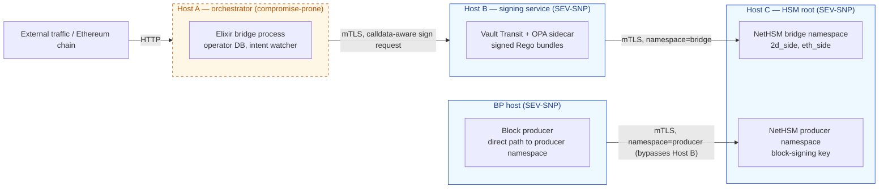
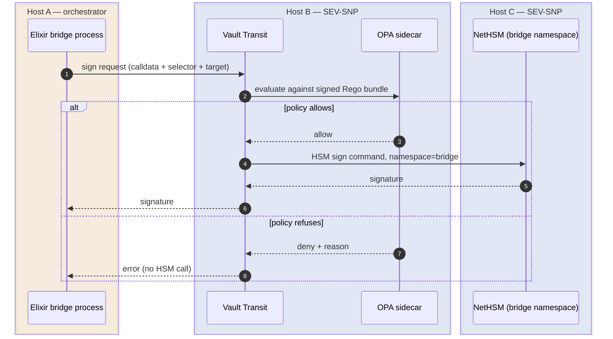

В статье про мост написано, *что* делает 2D, чтобы компрометация ключа оператора не давала минтить unbacked supply и не уводила пул. Пять привязок верификатора, on-chain `OperatorVault`, fail-closed signer policy. Каждый из этих слоёв — это код, который где-то крутится. Тут речь о том, *где именно он крутится*, и почему single-host shortcut обнуляет всю модель даже при безупречной policy в исходниках.

Аудитория — операторы, security reviewer-ы и все, кто оценивает deployment posture перед тем, как пускать через мост реальный капитал. Топология — фундамент, на котором [статья про мост](../bridge/) выстраивает рассуждения про safety.

## Почему ключи оператора — слабое место

Defense-in-depth моста по умолчанию считает любую signature, выпущенную ключом оператора, недоверенной. On-chain слои (`OperatorVault.bridgeOut`-капы, claimer-allowlist binding на стороне верификатора) ограничивают, *что* такая signature может выразить, даже если ключ полностью увели. Ровно вокруг этого предположения и проектируется всё остальное: атакующий с root-ом на хосте, где лежат ключи оператора, — самое дорогое, что может случиться с мостом, и топология должна не дать одному такому событию закончить чейн.

Двух ключей оператора достаточно, чтобы слить классический wrapped-bridge; на 2D тех же двух ключей не хватит, потому что on-chain слои отказываются от outbound-вызовов вне фиксированной формы. Но host compromise всё равно остаётся отправной точкой. Если `vault dev`, OPA sidecar и образ NetHSM крутятся как сервисы на одной Linux-коробке, root на ней читает память, подменяет OPA-bundle и подписывает что захочет. Off-chain защиты падают одновременно, в один шаг.

Топология делит off-chain signing path на три логических хоста с тремя независимыми границами доверия и оборачивает security-critical компоненты в AMD SEV-SNP, чтобы host-root на гипервизоре даже не дотягивался до in-memory ключей. On-chain слой потом сидит под всеми тремя как durable last line.

## Два ключа оператора плюс ключ продюсера

Операционно оператор моста — один участник. Криптографически — два разных ключа, каждый в отдельном signer-е и со своей областью применения. У block producer-а к ним добавляется третий ключ.

**2D-side ключ.** Подписывает precompile-вызовы `bridge_lock(...)` к `0x2D00…0003`. Block executor режет с этого адреса любые другие транзакции, поэтому единственное, что ключ умеет on-chain, — позвать bridge precompile. Сама по себе компрометация не даёт минтить unbacked supply: claimer-allowlist binding на стороне верификатора отбрасывает любой `Locked`-event на Ethereum, чей `claimer` не входит в operator allowlist. Атакующий, который сам себе фондирует Ethereum-lock с любым `claimer`, не доживает до 2D-side mint-а — его отсекут на верификаторе.

**Ethereum-side ключ.** Подписывает `bridgeOut(address,uint256)` на развёрнутом смарт-контракте `OperatorVault`. Произвольно перевести USDC он не может: единственный privileged outflow — это `bridgeOut`, и он заклёпан on-chain через `bridgeOutAllowlist`, `perTxCap` и точный rolling 24h `cumulativeCap`. Ни `lock`, ни `refund`, ни любой другой контракт ключ позвать не способен.

**Producer ключ.** Подписывает заголовки блоков. Bridge-полномочий у него нет — bridge-claim через этот ключ не идёт, — но компрометация позволяет производить блоки против правил чейна, поэтому он лежит за тем же hardware/TEE-substrate-ом, что и bridge-ключи, в отдельном namespace, с собственным signing path в обход bridge policy layer.

Все три ключа лежат в трёх **namespace**-ах одного NetHSM-образа: `bridge` с тегами `2d_side`/`eth_side` для двух operational ключей и отдельный `producer` для block-signing ключа. Изоляция на уровне namespace в NetHSM означает, что запрос, привязанный к одному namespace, до другого не дотянется, даже если вызывающий клиент скомпрометирован полностью.

## Три логических хоста

«Хост» в этом документе — это логический хост: отдельная VM или отдельная физическая машина с сетевой границей между ним и соседями. Деление держится на уровне границы даже когда два логических хоста физически живут на одном EPYC-сервере на pre-mainnet rehearsal. Хосты:

- **Host A — orchestrator.** Elixir bridge process: HTTP API, watcher Ethereum-цепи, operator database. Самый exposed, ловит весь user-traffic. Считается compromise-prone, даже несмотря на то, что это код, который мы сами написали.
- **Host B — signing service.** HashiCorp Vault Transit + OPA sidecar, который enforce-ит calldata-aware allowlist. Vault держит session identity, OPA проверяет policy bundle, HSM подписывает только то, что прошло обоих. Сетевые правила пускают inbound только `Host A → Host B`, а outbound — только `Host B → Host C` для bridge signing.
- **Host C — HSM root.** NetHSM-образ, держит все три ключа за namespace-изоляцией. Сетевые правила дают `Host B` доступ к namespace `bridge`, block producer-у — к namespace `producer`; всё остальное дропается. Management interface — на отдельном locked-down сегменте сети с M-of-N admin quorum.

Signing path block producer-а обходит Host B by design. Заголовки блоков имеют фиксированную форму, producer-ключ изолирован на уровне HSM-namespace, а прогон producer signature через bridge-side OPA-bundle добавляет latency без policy, которая что-то значила бы при подписи заголовков. Поэтому правило: **`Host B → Host C` namespace=bridge** *и* **BP host → Host C namespace=producer**, всё остальное — drop.

Two-host (orchestrator + Vault-with-HSM-on-same-box) валится при компрометации root-а на Host B: атакующий обходит OPA и зовёт HSM management API напрямую. Three-host ставит сетевую границу между policy decision (Host B) и хранением ключей (Host C); чтобы достать HSM-ключ с компрометации B, нужно ещё один шаг.

Zero-host (полностью on-chain) удобен, но через него каждая транзакция проходит без off-chain throttling. Host A неустраним: именно он генерирует calldata. Host B и Host C добавляют throttle-слои сверху; без них от компрометации Host A до «sign anything» — один шаг, пока on-chain `OperatorVault` не поймает.

## Signing path

Успешная bridge-claim signature проходит все хосты по порядку:

OPA-bundle — подписанная Rego policy, которая зеркалит in-process Elixir allowlist на Host A: 2D-side-запросы должны идти на `0x2D00…0003` с селектором `bridge_lock(...)`; Ethereum-side — на `OperatorVault` с `bridgeOut(address,uint256)`. Всё остальное — прямые ERC-20-трансферы, `lock()`, `refund()`, вызовы любых других контрактов — отбрасывается на policy time, ещё до того, как HSM получит запрос на подпись.

Bundle поддерживает hot-reload без рестарта signer-а, поэтому policy-обновления не прерывают работу; bundle distribution идёт по своему admin-only пути, а не по соединению orchestrator → signer. Файловая система Host B по возможности read-only; между всеми cross-host вызовами — mTLS с cert pinning.

## Confidential computing — что даёт SEV-SNP

Host B и Host C поднимаются как **AMD SEV-SNP** confidential VM-ы на EPYC-кремнии (3-е поколение Milan и новее). Хост block producer-а — то же самое. SEV-SNP шифрует память VM ключом, который держит AMD Secure Processor; гипервизор и kernel хоста по построению эту память не читают. На каждом cross-VM-соединении проверяется **launch measurement** пира — криптографический хеш boot image — против опубликованного значения. Подменённый образ падает на следующем attestation step и до sign-request не доживает.

Вид deployment-а: три SEV-SNP VM-ы и обычный orchestrator VM крутятся на одном EPYC-шасси на pre-mainnet rehearsal; on-chain слой стоит отдельно от топологии хостов:

```mermaid
architecture-beta
  group epyc(logos:linux-tux)["EPYC host (Milan or newer)"]

  service orch(logos:elixir)["vm-orch regular VM"] in epyc
  service vault(logos:vault)["vm-vault SEV-SNP"] in epyc
  service bp(logos:postgresql)["vm-bp SEV-SNP"] in epyc
  service hsm(logos:aws-kms)["vm-nethsm SEV-SNP"] in epyc

  group onchain(logos:ethereum)["On-chain layer"]
  service ovault(logos:ethereum)["OperatorVault"] in onchain
  service verifier(logos:ethereum)["Verifier binding"] in onchain

  orch:R --> L:vault
  vault:B --> T:hsm
  bp:R --> L:hsm
  vault:R --> L:ovault
  hsm:R --> L:verifier
```

Из этой trust model получается конкретный набор предположений, и его стоит выписать явно, чтобы reviewer мог их оспорить:

| Предположение | Статус |
|---|---|
| AMD signing root не скомпрометирован | Trusted. Компрометация AMD root-ключа уровня state-actor обнуляет каждую TEE-derived гарантию на этих хостах. |
| AMD PSP firmware пропатчен | Trusted с SLA. У PSP есть публичная история CVE; AMD-advisories отслеживаются, microcode-обновления накатываются с SLA по severity. Каждая новая PSP CVE заставляет пересмотреть mainnet HSM decision. |
| Гипервизор и kernel хоста | **Не trusted** для confidentiality. Host root по построению SEV-SNP память VM не читает. Это и покупается. |
| Launch measurement образа VM совпадает с expected | Gated. На каждом cross-VM-соединении проверяется launch measurement против expected hash. Сборка образа и публикация measurement — часть deploy-pipeline; reproducible builds обязательны, чтобы любой мог воспроизвести expected measurement из исходников. |
| Side-channel-ы (Spectre-class, power, timing) | Частично mitigated. AMD патчит по мере обнаружения; residual surface остаётся. Bridge-ключи не лежат в long-running in-process state вне HSM/Vault, что ограничивает то, что вытащит side-channel-leak. |

«Компрометация» хоста в таблице ниже — это либо software-компрометация *внутри* trust boundary (CVE в app/Postgres/kernel внутри TEE), либо полный TEE bypass (PSP CVE, AMD root compromise, side-channel state-actor attack). Выводы справедливы для обоих случаев.

## Defense in depth

Каждый слой ниже — отдельная дверь. Чтобы причинить ущерб соответствующего класса, атакующему нужно открыть каждую. Off-chain двери стоят на разных хостах; on-chain двери immutable и реплицированы на каждый честный verifier.

| Слой | Где работает | Что отбрасывает |
|---|---|---|
| In-process signer policy | Host A (orchestrator) | Sign-запросы вне calldata-aware allowlist. First pass; дублирует Host B, но ловит баги в коде до того, как они уйдут в сеть. |
| Calldata-aware allowlist | Host B (Vault + OPA) | Тот же allowlist, но enforced на signing service до похода в HSM. Переживает компрометацию Host A. |
| HSM namespace scoping | Host C (NetHSM) | Cross-namespace доступ. Скомпрометированный Host B дотягивается только до namespace `bridge`; namespace `producer` отсюда недостижим. |
| AMD SEV-SNP confidentiality | Host B, C, BP | Чтения памяти VM с host-root и из гипервизора. Даже с `sudo` на хосте сами ключи извлечь не получится. |
| Network policy + mTLS pinning | Между хостами | Signing-соединения откуда угодно, кроме явно разрешённого пира. Bundle distribution — по отдельному admin-каналу. |
| Verifier claimer-allowlist binding | On-chain (каждый честный verifier) | `bridge_lock` для Ethereum-`Locked`-event-а, чей `claimer` не в allowlist. Закрывает 2D-side-only компрометацию ключа. |
| `OperatorVault` on-chain caps | Ethereum, развёрнут | `bridgeOut` вне `bridgeOutAllowlist`, выше `perTxCap` или выше rolling 24h `cumulativeCap`. Закрывает Ethereum-side-only компрометацию. |
| Vault governance за multisig + timelock | Ethereum, governance principal | Капы, allowlist-ы и ротация signing-key вне time-windowed authority governance multisig-а. |

Слои со второго по пятый и есть причина, по которой топология держится на трёх хостах, а не на одном. Если host-split пропустить, слои в исходниках остаются, но остается только одна дверь вместо пяти.

## Что сохраняется при компрометации

Таблица ниже — worst case для каждой области компрометации. «On-chain слой» — это claimer-allowlist binding верификатора плюс развёрнутый `OperatorVault`; «off-chain слой» — всё от orchestrator-а до HSM-а.

| Область компрометации | Что ещё держится |
|---|---|
| Только Host A | Для **bridge** signing: Vault и OPA на Host B видят calldata и режут всё, что мимо allowlist; скомпрометированный orchestrator bridge-payload вне scope не получит. Для **block-producer** signing: BP-direct путь к Host C namespace=producer обходит Host B by design, поэтому producer-key signature off-chain не policy-gated при компрометации Host A. Block-content abuse (цензура, мошенническое включение в рамках ruleset) ограничен только самим ruleset чейна и verifier consensus по cross-chain bindings. Bridge-supply под защитой claimer-allowlist binding верификатора; более широкий BP-key abuse приходится ловить уже on-chain слоям. |
| Host A + Host B | Sign-anything на off-chain слое теперь возможен. Защищает только on-chain: claimer-allowlist binding (его replay-ит каждый честный verifier) плюс `OperatorVault` caps (allowlist, per-tx, rolling 24h). В сумме drain ограничен `cumulativeCap` за 24 часа, и unbacked mint всё равно отбрасывается. |
| Host A + Host B + Host C | Off-chain слой полностью subverted. On-chain ещё держится: verifier consensus отбрасывает unbacked mint-ы, `OperatorVault` режет out-of-scope outflow-ы. |
| Все хосты + verifier majority + `OperatorVault` governance | Catastrophic. Recovery — через halt paths и governance reset. За пределами designed defense scope. |

Coverage on-chain слоя не зависит от того, на каком физическом железе крутился off-chain. Ровно поэтому topology-документ и safety-документ разводят их как разные вещи.

## Forever software-in-TEE — pre-mainnet posture

Pre-mainnet (local dev, CI, staging, pre-launch) проект работает **без какого-либо физического HSM**. Роль HSM играет NetHSM, запущенный в software внутри AMD SEV-SNP VM. Это политика, а не aspiration, и она держится до mainnet sign-off.

Логика конкретная:

- **Memory encryption + attestation закрывает большую часть того, что закрывает физический HSM** для off-host-атакующих: host-root reads, hypervisor compromise, cold-boot, DMA. Не закрывает: AMD PSP firmware CVE, side-channel state-actor attack-и, отсутствие FIPS-сертификации в принципе. Современные AMD CPU действительно отдают `RDRAND`/`RDSEED`, но это не то же, что tamper-evident hardware TRNG с сертифицированным entropy source-ом.
- **На pre-mainnet ключах нет реальных средств.** Главная польза TEE-only — отрепетировать production-топологию end-to-end на том же железе, на котором поедет mainnet: attestation flow, namespace isolation, обвязка Vault и OPA, репликация audit-log, mTLS pinning. Купить физический HSM на этой стадии — пустая трата бюджета и operational friction без закрытия threat-а, который имеет значение прямо сейчас.
- **Path orchestrator → Vault → NetHSM одинаковый** что для software-NetHSM-in-TEE, что для физического appliance за тем же REST endpoint. Mainnet swap (если он случится) — это замена Host C, а не re-architecture. Ничего из pre-mainnet кода и топологии не пойдёт в утиль.

Mainnet decision (forever software-in-TEE против upgrade на физический appliance) откладывается и пересматривается ближе к запуску по трём критериям:

1. Сколько средств на operator wallet к моменту mainnet launch.
2. Регуляторные или юрисдикционные требования (ask), если они будут, на FIPS-сертифицированный hardware boundary.
3. AMD PSP CVE landscape на момент решения: patch cadence, residual unfixed advisories, side-channel research.

На столе есть третий вариант для mainnet — **hybrid posture**: Ethereum-side ключ кладём в маленький физический токен (FIPS 140-2 Level 3 hardware), 2D-side оставляем в software-NetHSM-in-TEE. Это диверсифицирует single-vendor firmware и supply-chain risk без покупки двух полных appliance-ов. Trade-off — operational complexity от двух гетерогенных signing backend-ов.

Pre-mainnet posture, заявленная явно с самого начала, важна потому, что отложенный выбор без default-а — это та же форма, что и тихий pre-commit на physical-HSM-or-bust позже. Заявление «forever software-in-TEE pre-mainnet» делает границу auditable: любой может сверить staging-железо с published image measurement, а любая «нам нужно завтра ставить физический HSM» паника превращается в documented deviation, а не unstated assumption.

## Pre-mainnet rehearsal vs mainnet posture

На pre-mainnet логические хосты можно совмещать на **одной или двух физических EPYC-машинах**, разделённых VM-границами:

- SEV-SNP VM-ы вокруг `vm-vault` (Host B), `vm-nethsm` (Host C) и `vm-bp` (block producer).
- Обычная KVM-граница вокруг `vm-orch` (Host A), который намеренно считается compromise-prone.

Co-location на этой стадии допустим, потому что на ключах нет реальных средств; задача — отрепетировать production-топологию end-to-end на той же hardware family, что будет крутить mainnet. Image-measurement attestation flow работает одинаково, лежат VM-ы на одной EPYC или на двух.

Для mainnet предпочитаем **отдельные физические машины** хотя бы под Host B и Host C, на разных network zones, с mTLS и явными allowlist-ами между ними. SEV-SNP-изоляция в пределах одной машины уменьшает hypervisor- и cold-boot-blast-radius, но не закрывает shared-power-supply и shared-side-channel сценарии; physical separation закрывает. DC-уровневые события (питание ДЦ, пожар, оптика) требуют geographic separation и трекаются отдельно как operational HA concern.

## Топология audit log

Append-only `bridge_audit_log` лежит на Postgres-е Host A с `REVOKE UPDATE, DELETE`, поэтому даже DB-роль самого orchestrator-а не перепишет прошлые записи. Чтобы evidence пережил компрометацию Host A, каждая запись зеркалится в read-only object storage на отдельном cloud-аккаунте или VPC, с object-lock retention. Скомпрометированный Host A может перестать писать новое, но прошлые записи он не перепишет; post-incident timeline сохраняется для forensic review.

Конкретный mirror destination, retention window и access-control story — operational decisions, зависящие от cloud-провайдера; на уровне документа важно одно: вторая копия живёт там, куда скомпрометированный orchestrator не дотянется.

## Trust model summary

Ключи оператора моста сидят за тремя слоями ограничений. Каждый из слоёв может упасть, и следующий продолжит держать:

1. **In-process и signing-service policy** отбрасывают outbound-вызовы вне `bridge_lock(...)` к precompile и `bridgeOut(address,uint256)` к развёрнутому vault. Компрометация на этом слое ограничена следующим.
2. **AMD SEV-SNP confidentiality** не даёт host-root-атакующему прочитать сами ключи, даже с `sudo` на хосте. Проверка launch measurement на каждом cross-VM-соединении не даёт подменить образ.
3. **On-chain слой** — durable last line. Claimer-allowlist binding верификатора отбрасывает `bridge_lock` для Ethereum-event-ов с non-allowlisted claimer. Развёрнутый `OperatorVault` enforce-ит `bridgeOut`-allowlist, per-tx cap и rolling 24h `cumulativeCap` против самого operator-адреса; governance — за multisig-ом и timelock-ом.

Чтобы провернуть успешный drain, нужна цепочка компрометаций от operator host через SEV-SNP attestation до on-chain governance, причём каждый слой сидит на своей authority и даёт свой blast radius. Off-chain слои покупают время и ограничивают размер любого одного события; on-chain слой ограничивает worst-case loss и не зависит ни от какого хоста.

На pre-mainnet off-chain слой полностью крутится в SEV-SNP VM-ах на EPYC-кремнии, без физического HSM в топологии. Это решение пересматривается на mainnet launch против value at risk и AMD PSP CVE landscape. Какой бы выбор там ни случился, path orchestrator → Vault → NetHSM остаётся прежним и on-chain слой держит свои капы; substrate HSM-а свапается за тем же REST endpoint.

## Как это вписывается в остальной чейн

- [Статья про мост](../bridge/) разбирает протокол и пять cross-chain bindings верификатора; здесь мы даём deployment context, который позволяет safety-аргументам моста выдерживать host-root-атакующих.
- [Статья про verifier](../verifier/) описывает block-by-block recheck верификатора, включая cross-chain hook, читающий через helios sidecar.
- On-chain `OperatorVault` живёт в репозитории [`2d-solidity`](https://github.com/igor53627/2d-solidity); контракт shipped и audited, его исходник — immutable last line, на которую этот документ ссылается на протяжении всего текста.
