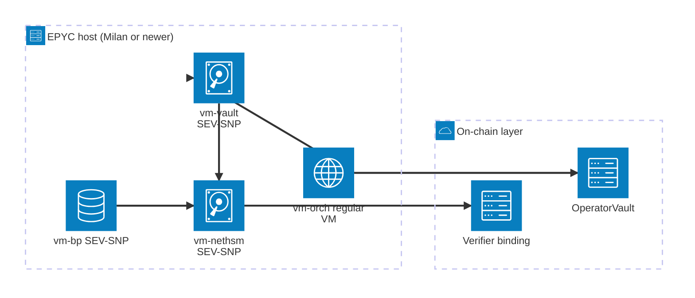

В статье про мост описано, *что* делает 2D, чтобы компрометация ключа оператора не позволяла минтить необеспеченную эмиссию и уводить пул. Несущие привязки верификатора, `OperatorVault` в сети Ethereum и политика подписания, которая по умолчанию отказывает. Каждый из этих слоёв живёт в конкретном коде и на конкретной инфраструктуре. Здесь речь о том, *где именно он запускается*, и почему упрощение до одного хоста ломает всю модель даже при безупречной политике в исходниках.

Аудитория документа: операторы, ревьюеры безопасности и все, кто оценивает модель развёртывания перед тем, как пускать через мост реальный капитал. Топология служит фундаментом, на котором [статья про мост](../bridge/) выстраивает аргумент безопасности.

## Почему ключи оператора - слабое место

Эшелонированная защита моста по умолчанию считает любую подпись, выпущенную ключом оператора, недоверенной. On-chain слои (`OperatorVault.bridgeOut`-капы, привязка claimer-а к allowlist-у на стороне верификатора) ограничивают, *что* такая подпись может выразить, даже если ключ полностью увели. Ровно вокруг этого предположения и проектируется всё остальное: атакующий с root-ом на хосте, где лежат ключи оператора, является отказом хоста с максимальным ущербом, и топология должна не дать одному такому событию закончить всю цепочку защиты.

Двух ключей оператора достаточно, чтобы слить классический wrapped-мост; на 2D тех же двух ключей не хватит, потому что on-chain слои отказываются от исходящих вызовов вне фиксированной формы. Но компрометация хоста всё равно остаётся отправной точкой. Если `vault dev`, сайдкар OPA и образ NetHSM крутятся как сервисы на одной Linux-коробке, root на ней читает память, подменяет OPA-bundle и подписывает что захочет. Off-chain защиты падают одновременно, в один шаг.

Топология делит off-chain путь подписи на три логических хоста с тремя независимыми границами доверия и оборачивает критичные для безопасности компоненты в AMD SEV-SNP, чтобы root на базовой машине даже не дотягивался до ключей в памяти. On-chain слой остаётся под всеми тремя как последняя устойчивая линия защиты.

## Два ключа оператора плюс ключ продюсера

С операционной точки зрения оператор моста выступает как один участник. Криптографически используются два разных ключа, каждый в отдельном подписанте и со своей областью применения. У производителя блоков к ним добавляется третий ключ.

**Ключ стороны 2D.** Подписывает precompile-вызовы `bridge_lock(...)` к `0x2D00…0003`. Исполнитель блоков режет с этого адреса любые другие транзакции, поэтому единственное, что ключ умеет on-chain, это вызвать bridge precompile. Сама по себе компрометация не даёт минтить необеспеченную эмиссию: привязка claimer-а к allowlist-у на стороне верификатора отбрасывает любой Ethereum-`Locked` event, чей `claimer` не входит в allowlist оператора. Атакующий, который сам себе фондирует Ethereum-lock с любым `claimer`, отсекается до минта на стороне 2D.

**Ключ стороны Ethereum.** Подписывает `bridgeOut(address,uint256)` на развёрнутом смарт-контракте `OperatorVault`. Произвольно перевести USDC он не может: единственный привилегированный вывод это `bridgeOut`, ограниченный on-chain через `bridgeOutAllowlist`, `perTxCap` и точный скользящий 24-часовой `cumulativeCap`. Ни `lock`, ни `refund`, ни любой другой контракт ключ позвать не способен.

**Ключ производителя.** Подписывает заголовки блоков. У него нет bridge-полномочий (bridge-claim через этот ключ не идёт), но компрометация позволяет злоупотреблять полномочиями производителя блоков, пока консенсус верификаторов или пути остановки это не остановят. Невалидные блоки всё равно должны отклоняться правилами цепи. Поэтому ключ лежит за тем же hardware/TEE-субстратом, что и bridge-ключи, в отдельном namespace, с собственным путём подписи в обход слоя bridge policy.

Все три ключа лежат в двух **namespace** одного NetHSM-образа: `bridge` с тегами ключей `2d_side`/`eth_side` для двух операционных ключей и отдельный `producer` для ключа подписи блоков. Изоляция на уровне namespace в NetHSM означает, что запрос, привязанный к одному namespace, до другого не дотянется, даже если вызывающий клиент скомпрометирован полностью.

## Три логических хоста

Под «хостом» в этом документе подразумевается логический хост: отдельная VM или отдельная физическая машина с сетевой границей между ним и соседями. Деление держится на уровне границы даже когда два логических хоста физически живут на одном EPYC-сервере во время pre-mainnet rehearsal. Хосты:

- **Host A: оркестратор.** Elixir-процесс моста: HTTP API, watcher Ethereum-цепи, база оператора. Это самый открытый наружу компонент, через него идёт пользовательский трафик. Считается наиболее подверженным компрометации, даже несмотря на то, что это наш собственный код.
- **Host B: сервис подписи.** HashiCorp Vault Transit + сайдкар OPA, который применяет calldata-aware allowlist. Vault держит identity сессии, OPA проверяет policy bundle, HSM подписывает только то, что прошло оба слоя. Сетевые правила пускают входящие соединения только `Host A → Host B`, а исходящие - только `Host B → Host C` для bridge-подписей.
- **Host C: HSM-корень.** NetHSM-образ держит все три ключа за namespace-изоляцией. Сетевые правила дают `Host B` доступ к namespace `bridge`, производителю блоков - к namespace `producer`; всё остальное дропается. Интерфейс управления вынесен в отдельный закрытый сетевой сегмент с M-of-N админским кворумом.

Начиная со staging, производитель блоков запускается в отдельной SEV-SNP VM, чтобы уменьшить радиус поражения. На диаграмме он показан отдельно, потому что его путь подписи обходит Host B, но он не становится четвёртым хостом в пути bridge-подписей: bridge-подписи всё равно идут по маршруту Host A → Host B → Host C.

Путь подписи производителя блоков специально обходит Host B. Заголовки блоков имеют фиксированную форму, producer-ключ изолирован на уровне HSM-namespace, а прогон подписи производителя через bridge-side OPA-bundle добавляет задержку без полезной политики для подписи заголовков. Поэтому правило: **`Host B → Host C` namespace=bridge** *и* **BP host → Host C namespace=producer**, всё остальное отбрасывается.

Схема на двух хостах (оркестратор + Vault-with-HSM-on-same-box) валится при компрометации root-а на Host B: атакующий обходит OPA и зовёт HSM management API напрямую. Схема на трёх хостах ставит сетевую границу между решением политики (Host B) и хранением ключей (Host C); с одной компрометацией B до материала ключей или HSM management plane уже не добраться.

Zero-host (полностью on-chain) удобен, но через него каждая транзакция проходит без off-chain троттлинга. Host A неустраним: именно он генерирует calldata. Host B и Host C добавляют throttle-слои сверху; без них от компрометации Host A до «подписать что угодно» остается всего один шаг, пока on-chain `OperatorVault` не поймает.

## Путь подписи

Успешный запрос на bridge-подпись проходит все bridge-хосты по порядку:

OPA-bundle - это подписанная Rego policy, которая должна оставаться синхронной с in-process Elixir allowlist на Host A. В post-`OperatorVault` продакшен-модели, описанной здесь, 2D-side-запросы должны идти на `0x2D00…0003` с селектором `bridge_lock(...)`, а Ethereum-side запросы - на сконфигурированный `OperatorVault` с `bridgeOut(address,uint256)`. Всё остальное - прямые ERC-20-трансферы, `lock()`, `refund()`, вызовы любых других контрактов - отбрасывается на этапе политики, ещё до того, как HSM получит запрос на подпись.

OPA bundle поддерживает горячую перезагрузку без рестарта подписанта, поэтому обновления политики не прерывают работу; доставка bundle идёт по своему admin-only пути, а не по соединению orchestrator → signer. Файловая система Host B по возможности read-only; между всеми межхостовыми вызовами - mTLS с cert pinning.

## Конфиденциальные вычисления: что даёт SEV-SNP

Host B и Host C поднимаются как **AMD SEV-SNP** confidential VM на EPYC-процессорах (3-е поколение Milan и новее). Хост производителя блоков устроен аналогично. SEV-SNP шифрует память VM ключом, который держит AMD Secure Processor; гипервизор и ядро хоста по построению эту память не читают. На каждом cross-VM-соединении проверяется **launch measurement** пира - криптографический хеш boot image - против опубликованного значения. Подменённый образ падает на следующем шаге attestation и не получает запрос на подпись.

Вид развёртывания: три SEV-SNP VM и обычная VM оркестратора крутятся на одном EPYC-шасси на pre-mainnet rehearsal; on-chain слой стоит отдельно от топологии хостов:

Эта модель доверия опирается на конкретный набор предположений, и его стоит выписать явно, чтобы ревьюер мог их оспорить:

| Предположение | Статус |
|---|---|
| AMD signing root не скомпрометирован | Доверенное предположение. Компрометация AMD root-ключа уровня state actor обнуляет каждую TEE-derived гарантию на этих хостах. |
| AMD PSP firmware пропатчен | Доверенное предположение с SLA. У PSP есть публичная история CVE; AMD-advisories отслеживаются, microcode-обновления накатываются с SLA по severity. Каждая новая PSP CVE заставляет пересмотреть mainnet-решение по HSM. |
| Гипервизор и ядро хоста | **Не доверены** для конфиденциальности. Host root по построению SEV-SNP память VM не читает. Это и покупается. |
| Launch measurement образа VM совпадает с expected | Проверяется как gate. На каждом cross-VM-соединении launch measurement сверяется с expected hash. Сборка образа и публикация measurement - часть deploy pipeline; reproducible builds обязательны, чтобы любой мог воспроизвести expected measurement из исходников. |
| Side-channel-ы (Spectre-class, power, timing) | Частично закрыты. AMD патчит по мере обнаружения; остаточная поверхность остаётся. Bridge-ключи не лежат в long-running in-process state вне HSM/Vault, что ограничивает то, что вытащит side-channel leak. |

Под «компрометацией» хоста в таблице ниже понимается либо software-компрометация *внутри* границы доверия (CVE в app/Postgres/kernel внутри TEE), либо полный обход TEE (PSP CVE, компрометация AMD root, side-channel атака уровня state actor). Выводы справедливы для обоих случаев.

## Эшелонированная защита по слоям

Каждый из перечисленных ниже слоёв выступает в роли отдельной двери. Чтобы причинить ущерб соответствующего класса, атакующему нужно открыть каждую. Off-chain двери стоят на разных хостах; on-chain двери неизменяемы и реплицированы на каждый честный verifier.

| Слой | Где работает | Что отбрасывает |
|---|---|---|
| In-process signer policy | Host A (оркестратор) | Запросы на подпись вне calldata-aware allowlist. Первый проход; дублирует Host B, но ловит баги в коде до того, как они уйдут в сеть. |
| Calldata-aware allowlist | Host B (Vault + OPA) | Тот же allowlist, но применяется на сервисе подписи до похода в HSM. Переживает компрометацию Host A. |
| HSM namespace scoping | Host C (NetHSM) | Доступ между namespace. Скомпрометированный Host B дотягивается только до namespace `bridge`; namespace `producer` отсюда недостижим. |
| AMD SEV-SNP confidentiality | Host B, C, BP | Чтения памяти VM с host-root и из гипервизора. Даже с `sudo` на хосте сами ключи извлечь не получится. |
| Network policy + mTLS pinning | Между хостами | Signing-соединения откуда угодно, кроме явно разрешённого пира. Доставка bundle - по отдельному admin-каналу. |
| Verifier claimer-allowlist binding | On-chain (каждый честный verifier) | `bridge_lock` для Ethereum-`Locked` event-а, чей `claimer` не в allowlist. Закрывает 2D-side-only компрометацию ключа. |
| `OperatorVault` on-chain caps | Ethereum, развёрнут | `bridgeOut` вне `bridgeOutAllowlist`, выше `perTxCap` или выше скользящего 24-часового `cumulativeCap`. Ограничивает Ethereum-side-only компрометацию заданной policy envelope. |
| Vault governance за multisig + timelock | Ethereum, governance principal | Капы, allowlist-ы и ротация signing-key вне time-windowed authority governance multisig-а. |

Слои со второго по пятый как раз и являются причиной, по которой топология держится на трёх хостах, а не на одном. Если host-split пропустить, слои в исходниках остаются, но остается только одна дверь вместо пяти.

## Что сохраняется при компрометации

В таблице ниже представлен худший случай для каждой области компрометации. Под «on-chain слоем» здесь понимается привязка claimer-а к allowlist-у верификатора вместе с развёрнутым `OperatorVault`, а под «off-chain слоем» подразумевается всё от оркестратора до HSM.

| Область компрометации | Что ещё держится |
|---|---|
| Только Host A | Для **bridge** signing: Vault и OPA на Host B видят calldata и режут всё, что мимо allowlist; скомпрометированный оркестратор не получит bridge-payload вне scope. Отдельный BP host и namespace `producer` в staging/mainnet topology из этого пути недостижимы. |
| Только BP host / producer key | Bridge signing не затронут, потому что BP path дотягивается только до namespace `producer` на Host C. Атакующий может злоупотреблять полномочиями производителя блоков для цензуры, переупорядочивания или валидных, но вредных block proposals, пока консенсус верификаторов или пути остановки не среагируют; невалидные блоки всё равно не проходят проверку правил цепи. |
| Host A + Host B | Sign-anything на off-chain слое теперь возможен. Защищает только on-chain: привязка claimer-а к allowlist-у (её переигрывает каждый честный verifier) плюс `OperatorVault` caps (allowlist, per-tx, rolling 24h). В сумме drain ограничен `cumulativeCap` за 24 часа, и необеспеченный mint всё равно отбрасывается. |
| Host A + Host B + Host C | Off-chain слой полностью подчинён атакующему. On-chain ещё держится: консенсус верификаторов отбрасывает необеспеченные mint-ы, `OperatorVault` режет out-of-scope outflow-ы. |
| Все хосты, включая BP, + verifier majority + `OperatorVault` governance | Катастрофический сценарий. Восстановление - через пути остановки и governance reset. За пределами рассчитанной модели защиты. |

Покрытие on-chain слоя не зависит от того, на каком физическом железе крутился off-chain. Ровно поэтому документ о топологии и документ о безопасности разводят эти вопросы.

## Forever software-in-TEE на pre-mainnet

На pre-mainnet (local dev, CI, staging, pre-launch) проект работает **без какого-либо физического HSM**. Роль HSM играет NetHSM, запущенный как software внутри AMD SEV-SNP VM. Это строгая политика, а не просто aspiration, и она держится до mainnet sign-off.

Логика конкретная:

- **Шифрование памяти + attestation закрывают большую часть того, что закрывает физический HSM** для атакующих вне хоста: чтение памяти с host-root, компрометацию гипервизора, cold boot, DMA. Не закрывают: AMD PSP firmware CVE, side-channel атаки уровня state actor, отсутствие FIPS-сертификации в принципе. Современные AMD CPU действительно отдают `RDRAND`/`RDSEED`, но это не то же, что tamper-evident hardware TRNG с сертифицированным источником энтропии.
- **На pre-mainnet ключах нет реальных средств.** Главная польза TEE-only - отрепетировать продакшен-топологию end-to-end на том же железе, на котором поедет mainnet: attestation flow, namespace isolation, обвязка Vault и OPA, репликация audit-log, mTLS pinning. Купить физический HSM на этой стадии - пустая трата бюджета и operational friction без закрытия threat-а, который имеет значение прямо сейчас.
- **Маршрут orchestrator → Vault → NetHSM одинаковый** что для software-NetHSM-in-TEE, что для физического appliance за тем же REST endpoint. В случае mainnet swap происходит лишь замена Host C, а не глобальная перестройка архитектуры. Ничего из pre-mainnet кода и топологии не пойдёт в утиль.

Mainnet-решение - оставить forever software-in-TEE или перейти на физический appliance - откладывается и пересматривается ближе к запуску по трём критериям:

1. Сколько средств на operator wallet к моменту mainnet launch.
2. Регуляторные или юрисдикционные требования, если они будут, на FIPS-сертифицированную hardware boundary.
3. AMD PSP CVE landscape на момент решения: patch cadence, residual unfixed advisories, side-channel research.

Для mainnet рассматривается и третий вариант, **гибридная модель**: Ethereum-side ключ помещается в маленький физический токен (FIPS 140-2 Level 3 hardware), 2D-side остаётся в software-NetHSM-in-TEE. Это диверсифицирует single-vendor firmware и supply-chain risk без покупки двух полных appliance-ов. Цена - operational complexity от двух гетерогенных signing backend-ов.

Явно заявленная pre-mainnet-модель важна потому, что отложенный выбор без default-варианта по сути является тихим pre-commit на physical-HSM-or-bust позже. Заявление «forever software-in-TEE pre-mainnet» делает границу проверяемой: любой может сверить staging-железо с опубликованным image measurement, а срочный переход на физический HSM становится documented deviation, а не unstated assumption.

## Pre-mainnet rehearsal и mainnet-модель

На pre-mainnet логические хосты можно совмещать на **одной или двух физических EPYC-машинах**, разделённых VM-границами:

- SEV-SNP VM вокруг `vm-vault` (Host B), `vm-nethsm` (Host C) и `vm-bp` (производитель блоков).
- Обычная KVM-граница вокруг `vm-orch` (Host A), который намеренно считается наиболее подверженным компрометации.

Совмещение на этой стадии допустимо, потому что на ключах нет реальных средств; задача - отрепетировать продакшен-топологию end-to-end на той же hardware family, что будет крутить mainnet. Image-measurement attestation flow работает одинаково, независимо от того, лежат VM на одной EPYC или на двух.

Для mainnet предпочитаем **отдельные физические машины** хотя бы под Host B и Host C, в разных сетевых зонах, с mTLS и явными allowlist-ами между ними. SEV-SNP-изоляция в пределах одной машины уменьшает hypervisor- и cold-boot blast radius, но не закрывает shared-power-supply и shared-side-channel сценарии; физическое разделение закрывает. События уровня ДЦ (питание, пожар, оптика) требуют географического разнесения и трекаются отдельно как operational HA concern.

## Топология audit log

Append-only `bridge_audit_log` лежит на Postgres-е Host A с `REVOKE UPDATE, DELETE`, поэтому даже DB-роль самого оркестратора не перепишет прошлые записи. Чтобы evidence пережил компрометацию Host A, каждая запись зеркалится в read-only object storage на отдельном cloud-аккаунте или VPC, с object-lock retention. Скомпрометированный Host A может перестать писать новое, но прошлые записи он не перепишет; post-incident timeline сохраняется для forensic review.

Конкретные mirror destination, retention window и access-control story - операционные решения, зависящие от cloud-провайдера; на уровне документа важно одно: вторая копия живёт там, куда скомпрометированный оркестратор не дотянется.

## Итоговая модель доверия

Ключи оператора моста сидят за тремя слоями ограничений. Каждый из слоёв может упасть, и следующий продолжит держать:

1. **In-process и signing-service policy** отбрасывают исходящие вызовы вне `bridge_lock(...)` к precompile и `bridgeOut(address,uint256)` к развёрнутому vault. Компрометация на этом слое ограничена следующим.
2. **AMD SEV-SNP confidentiality** не даёт host-root-атакующему прочитать сами ключи, даже с `sudo` на хосте. Проверка launch measurement на каждом cross-VM-соединении не даёт подменить образ.
3. **On-chain слой** выступает как устойчивая последняя линия. Claimer-allowlist binding верификатора отбрасывает `bridge_lock` для Ethereum-event-ов с claimer-ом вне allowlist. Развёрнутый `OperatorVault` применяет `bridgeOut`-allowlist, per-tx cap и скользящий 24-часовой `cumulativeCap` против самого operator-адреса; governance управляется multisig-ом и timelock-ом.

Чтобы провернуть успешный drain, нужна цепочка компрометаций от operator host через SEV-SNP attestation до on-chain governance, причём каждый слой сидит на своей authority и даёт свой blast radius. Off-chain слои покупают время и ограничивают размер любого одного события; on-chain слой ограничивает худшую потерю и не зависит ни от какого хоста.

На pre-mainnet off-chain слой полностью крутится в SEV-SNP VM на EPYC-процессорах, без физического HSM в топологии. Это решение пересматривается к mainnet launch с учётом value at risk и AMD PSP CVE landscape. Какой бы выбор там ни случился, маршрут orchestrator → Vault → NetHSM остаётся прежним и on-chain слой держит свои капы; HSM-субстрат меняется за тем же REST endpoint.

## Как это вписывается в остальную цепь

- [Статья про мост](../bridge/) разбирает протокол, несущие cross-chain привязки верификатора и receipt-block проверку claimer/hash; здесь мы даём контекст развёртывания, который позволяет safety-аргументам моста выдерживать host-root-атакующих.
- [Статья про verifier](../verifier/) описывает block-by-block recheck верификатора, включая cross-chain hook, читающий через helios sidecar.
- On-chain `OperatorVault` живёт в репозитории [`2d-solidity`](https://github.com/igor53627/2d-solidity); контракт отгружен и прошёл аудит, его исходник - неизменяемая последняя линия защиты, на которую этот документ ссылается на протяжении всего текста.
