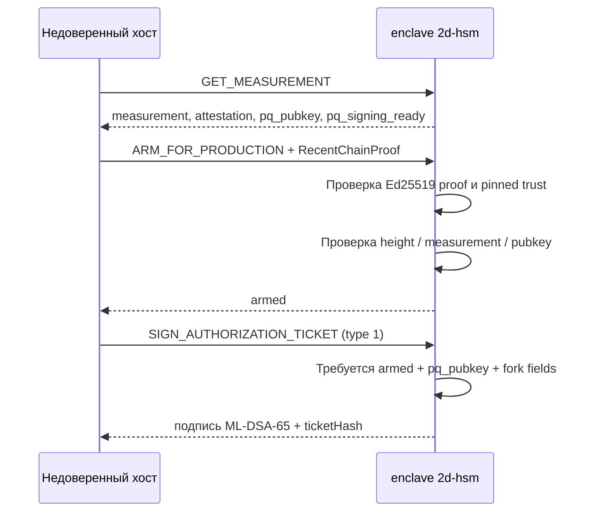

В [HSM-топологии оператора моста](../hsm-topology/) описано размещение **мостовых** ключей: оркестратор, Vault + OPA и пространства имён NetHSM на трёх хостах. У **производителя блоков** отдельный долгоживущий постквантовый ключ для заголовков блоков и для on-chain `AuthorizationTicket` (recovery производителя и активация hard fork). Этот путь реализует эталонный анклав [**2d-hsm**](https://github.com/igor53627/2d-hsm): компактный PQ signing service внутри AMD SEV-SNP (или Nitro Enclaves) с CBOR-протоколом поверх vsock к недоверенному хосту 2D.

Здесь — обзор архитектуры сервиса. Нормативный vsock wire format описан в [`vsock-api-wire-format-spec-draft.md`](https://github.com/igor53627/2d-hsm/blob/main/backlog/docs/vsock-api-wire-format-spec-draft.md); нормативный ABI `AuthorizationTicket`, подписываемый preimage и правила `contextHash` — в [`authorization-tickets-precompile-spec-draft.md`](https://github.com/igor53627/2d-hsm/blob/main/backlog/docs/authorization-tickets-precompile-spec-draft.md).

## Зона ответственности анклава

| Задача | Примечание |
|---|---|
| **PQ-подписи производителя блоков** | ML-DSA-65 (FIPS 204) над 32-байтовым дайджестом блока на hot path (~2 с). |
| **Подписи `AuthorizationTicket`** | Канонический `ticketHash` (Keccak256 + preimage как в Solidity); типы **0** recovery и **1** hard fork. |
| **Сеть как второй фактор** | `ARM_FOR_PRODUCTION` требует проверенного `RecentChainProof` (Producer Chain Attestation v1, Ed25519) до arming. |
| **Поверхность аттестации** | `GET_MEASUREMENT` возвращает `measurement`, `attestation` и `pq_pubkey`, связанные в remote attestation. |

Анклав **не** реализует политику моста `bridge_lock` / `bridgeOut`; это остаётся в топологии оператора моста. Ключ производителя — третья криптографическая роль с отдельным namespace и путём подписи.

## Граница доверия хост ↔ анклав

Процесс хоста 2D недоверен. Он может подделывать vsock-кадры, воспроизводить старые доказательства (proof) или сообщать ложные данные о вершине (tip) цепи. Анклав обязан работать в режиме fail-closed: отклонять некорректные данные (wire format), тикеты без активации (arming), поддельные или устаревшие `RecentChainProof`, и отказываться подписывать без установленного ML-DSA-65 ключа.

**Важно:** `ProducerAttestationTrust` (Ed25519 для проверки chain proof) загружается **внутри** анклава из sealed config или attested provisioning. Его нельзя передавать с хоста в payload `ARM_FOR_PRODUCTION`.

## Команды vsock (v1)

4 байта длины (BE), байт версии протокола, байт типа сообщения, CBOR (макс. 1 MiB). Внутренние ARM / GET_STATUS / SIGN — integer map keys по спецификации.

| Команда | Назначение |
|---|---|
| `GET_MEASUREMENT` | Remote attestation + `pq_pubkey` + `supported_ticket_types` + `pq_signing_ready`. |
| `ARM_FOR_PRODUCTION` | Armed state после проверки `RecentChainProof` и согласованности measurement. |
| `GET_STATUS` | Метаданные arming, pending hard fork, последний блок из proof. |
| `SIGN_AUTHORIZATION_TICKET` | Подпись `ticketHash`; type 1 — только после arm и stateful dispatch. |

**Разделение диспетчеризации (dispatch) в эталонной библиотеке (crate):**

- **Stateless** `dispatch_command` — recovery (type 0) и `GET_MEASUREMENT`; arm / hard fork возвращают ошибку с указанием stateful path.
- **Stateful** `dispatch_command_with_state` — arming, `GET_STATUS`, hard-fork signing с `EnclaveState` и pinned trust.

## Криптопрофиль

| Параметр | Production |
|---|---|
| Алгоритм | ML-DSA-65 |
| `pq_pubkey` | **1952** байт |
| `signature` | **3309** байт (pure ML-DSA над 32-байтовым `ticketHash`) |
| Chain proof | Ed25519 над domain-separated preimage (v1) |

**`pq_signing_ready`:** `true` только после успешного `install_sealed_pq_signer` при boot. Дефолтные сборки без вшитого секрета; до provisioning — `PqSigningUnavailable`. Mock-пиры: `pq_signing_ready == false` и 64-байтовая PQ-подпись (`test-support` + `demo-mock-sign`).

**Sealed key (TASK-1):** Production seal v1 — ChaCha20Poly1305 AEAD с measurement-bound ключом, производным от 32-байтового provisioning root через SHA3-256 (домен `2d-hsm-pq-seal-v1-key`). Provkey root извлекается из firmware SEV-SNP через boot-helper `snp-derive-root` (SNP_GET_DERIVED_KEY ioctl → SHA3-256 domain-separated), записывается в `/run/twod-hsm/pq-seal-root.bin` при загрузке и читается анклавом через release-safe фичу `platform-root-from-boot-file` (фиксированный путь, не env var хоста). Формат v0 XOR — только `#[cfg(test)]`; вне тестов `ml-dsa-65` принимает v1 и отклоняет v0. Sealed-boot ceremony + selftest валидированы на aya; безопасность опирается на measured boot (образ NixOS + oneshot snp-derive-root — часть измеряемого SNP launch).

## Arming и hard fork

Hard-fork тикеты — через `handle_sign_authorization_ticket_with_state` после валидного arm. Recovery (type 0) может идти stateless path при bootstrap, но `pq_pubkey` в тикете должен совпадать с ключом анклава, если signer установлен.

Авторизация hard fork привязана к эпохе производителя, а не только к PQ-ключу. Тикет, подписанный производителем A в старой эпохе, не должен быть воспроизводим после ротации A → B → A. Поэтому on-chain/precompile сторона пересчитывает hard-fork `contextHash` из текущего ключа производителя и высоты его активации и отклоняет несовпадение. Эта страница остаётся архитектурным обзором; точный byte-level preimage задаёт спецификация `AuthorizationTicket` в репозитории `2d-hsm`, ссылка выше.

Recovery производителя в native chain также ещё не является production-active функцией по умолчанию. Finalized-tip downtime gate уже есть в коде precompile `2d`, но `record_finalized_tip/2` пока не подключён к finality path исполнителя блоков. До этой интеграции native `PRODUCER_RECOVERY` остаётся fail-closed (`no_finalized_tip`), а не рекламируется как активный production recovery. Solidity reference моделирует это явным relay/height stand-in, а не финальным native source of truth.

## Статус реализации

В [`impl/rust/enclave-protocol`](https://github.com/igor53627/2d-hsm/tree/main/impl/rust/enclave-protocol): framing, `ticketHash`, cross-check с Solidity, `EnclaveState`, Producer Chain Attestation v1, ML-DSA-65 с fail-closed defaults.

Впереди: обновление вершины цепи между arm и sign (proof проверяется при arm, но не re-check на каждый блок), Elixir-прослойка (shim) и полноценный транспорт vsock в production deployment.

## Связь с топологией моста

В [топологии моста](../hsm-topology/) ключ производителя идёт в namespace `producer` NetHSM с BP-хоста, минуя Vault/OPA моста. **2d-hsm** — целевая минимальная модель анклава этой роли на цепи 2D: PQ-тикеты и подпись блоков в одном аудируемом сервисе, vsock — единственный интерфейс к хосту. На этапе pre-mainnet репетиций несколько VM могут по-прежнему работать на одном шасси EPYC; логическая граница (хост недоверен, анклав хранит PQ-секрет) одна и та же — неважно, запускается образ как software-NetHSM в SEV-SNP или как будущий физический HSM за той же API.

## Дальше

- [HSM-топология оператора моста](../hsm-topology/)
- [Модель безопасности](../security/)
- [Репозиторий 2d-hsm](https://github.com/igor53627/2d-hsm)