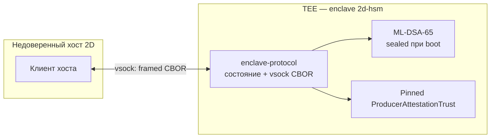

В [HSM-топологии оператора моста](./hsm-topology/) описано размещение **мостовых** ключей: оркестратор, Vault + OPA и пространства имён NetHSM на трёх хостах. У **производителя блоков** отдельный долгоживущий постквантовый ключ для заголовков блоков и для on-chain `AuthorizationTicket` (recovery производителя и активация hard fork). Этот путь реализует референсный enclave [**2d-hsm**](https://github.com/igor53627/2d-hsm): компактный PQ signing service внутри AMD SEV-SNP (или Nitro Enclaves) с CBOR-протоколом поверх vsock к недоверенному хосту 2D.

Здесь — обзор архитектуры сервиса. Нормативный wire format и инварианты безопасности — в [`vsock-api-wire-format-spec-draft.md`](https://github.com/igor53627/2d-hsm/blob/main/backlog/docs/vsock-api-wire-format-spec-draft.md) в репозитории.

## Зона ответственности enclave

| Задача | Примечание |
|---|---|
| **PQ-подписи производителя блоков** | ML-DSA-65 (FIPS 204) над 32-байтовым дайджестом блока на hot path (~2 с). |
| **Подписи `AuthorizationTicket`** | Канонический `ticketHash` (Keccak256 + preimage как в Solidity); типы **0** recovery и **1** hard fork. |
| **Сеть как второй фактор** | `ARM_FOR_PRODUCTION` требует проверенного `RecentChainProof` (Producer Chain Attestation v1, Ed25519) до arming. |
| **Поверхность аттестации** | `GET_MEASUREMENT` возвращает `measurement`, `attestation` и `pq_pubkey`, связанные в remote attestation. |

Enclave **не** реализует политику моста `bridge_lock` / `bridgeOut`; это остаётся в топологии оператора моста. Ключ производителя — третья криптографическая роль с отдельным namespace и путём подписи.

## Граница доверия хост ↔ enclave

Процесс хоста 2D недоверен. Он может подделывать vsock-кадры, воспроизводить старые proof или врать о tip цепи. Enclave обязан работать fail-closed: отклонять битый wire, тикеты без arming (для hard fork), поддельные или устаревшие `RecentChainProof`, и отказываться подписывать без установленного ML-DSA-65 ключа.

**Важно:** `ProducerAttestationTrust` (Ed25519 для проверки chain proof) загружается **внутри** enclave из sealed config или attested provisioning. Его нельзя передавать с хоста в payload `ARM_FOR_PRODUCTION`.

## Команды vsock (v1)

4 байта длины (BE), байт версии протокола, байт типа сообщения, CBOR (макс. 1 MiB). Внутренние ARM / GET_STATUS / SIGN — integer map keys по спецификации.

| Команда | Назначение |
|---|---|
| `GET_MEASUREMENT` | Remote attestation + `pq_pubkey` + `supported_ticket_types` + `pq_signing_ready`. |
| `ARM_FOR_PRODUCTION` | Armed state после проверки `RecentChainProof` и согласованности measurement. |
| `GET_STATUS` | Метаданные arming, pending hard fork, последний блок из proof. |
| `SIGN_AUTHORIZATION_TICKET` | Подпись `ticketHash`; type 1 — только после arm и stateful dispatch. |

**Разделение dispatch в референсном crate:**

- **Stateless** `dispatch_command` — recovery (type 0) и `GET_MEASUREMENT`; arm / hard fork возвращают ошибку с указанием stateful path.
- **Stateful** `dispatch_command_with_state` — arming, `GET_STATUS`, hard-fork signing с `EnclaveState` и pinned trust.

## Криптопрофиль

| Параметр | Production |
|---|---|
| Алгоритм | ML-DSA-65 |
| `pq_pubkey` | **1952** байт |
| `signature` | **3309** байт (pure ML-DSA над 32-байтовым `ticketHash`) |
| Chain proof | Ed25519 над domain-separated preimage (v1) |

**`pq_signing_ready`:** `true` только после успешного `install_sealed_pq_signer` при boot. Дефолтные сборки без вшитого секрета; до provisioning — `PqSigningUnavailable`. Mock-пиры: `pq_signing_ready == false` и 64-байтовая PQ-подпись (`test-support` + `demo-mock-sign`).

**Sealed key (TASK-1):** Платформенный seal ещё не реализован. v0 XOR + measurement — только `cargo test`; вне тестов `ml-dsa-65` install отклоняется.

## Arming и hard fork

Hard-fork тикеты — через `handle_sign_authorization_ticket_with_state` после валидного arm. Recovery (type 0) может идти stateless path при bootstrap, но `pq_pubkey` в тикете должен совпадать с ключом enclave, если signer установлен.

## Статус реализации

В [`impl/rust/enclave-protocol`](https://github.com/igor53627/2d-hsm/tree/main/impl/rust/enclave-protocol): framing, `ticketHash`, cross-check с Solidity, `EnclaveState`, Producer Chain Attestation v1, ML-DSA-65 с fail-closed defaults.

Впереди: production seal, обновление chain tip между arm и sign, integer-key CBOR для всех команд, Elixir shim, боевой vsock.

## Связь с топологией моста

В [топологии моста](./hsm-topology/) ключ производителя идёт в namespace `producer` NetHSM с BP-хоста, минуя Vault/OPA моста. **2d-hsm** — целевая минимальная enclave-модель этой роли на цепи 2D: PQ-тикеты и подпись блоков в одном аудируемом сервисе, vsock — единственный интерфейс к хосту.

## Дальше

- [HSM-топология оператора моста](./hsm-topology/)
- [Модель безопасности](./security/)
- [Репозиторий 2d-hsm](https://github.com/igor53627/2d-hsm)